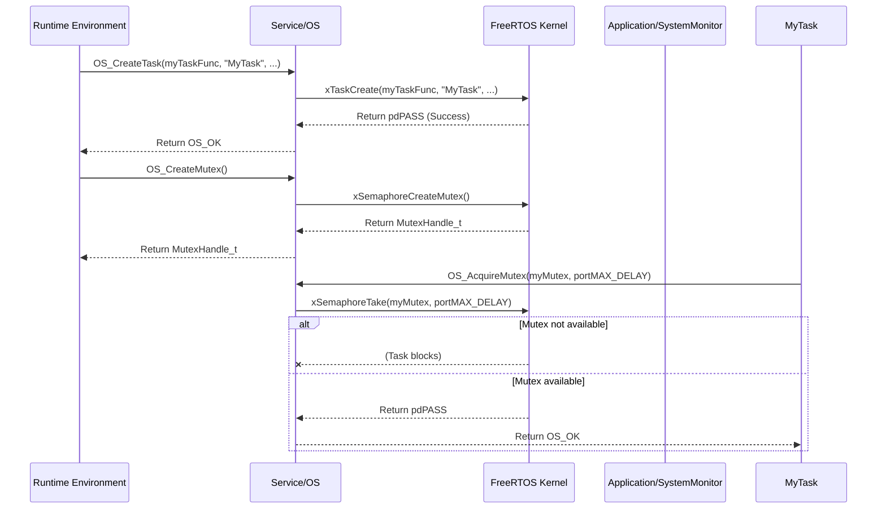

# **Detailed Design Document: OS Component**

## **1. Introduction**

### **1.1. Purpose**

This document details the design of the OS component, which provides an abstraction layer for the underlying Real-Time Operating System (RTOS), FreeRTOS in this case. Its primary purpose is to encapsulate direct FreeRTOS API calls, offering a standardized interface for OS services (task management, synchronization, time management) to higher layers, thereby promoting portability and making it easier to swap or update the RTOS in the future if needed.

### **1.2. Scope**

The scope of this document covers the OS module's architecture, functional behavior, interfaces, dependencies, and resource considerations. It details how the Service layer provides OS functionalities to the Runtime Environment (RTE) and other Service layer modules.

### **1.3. References**

* Software Architecture Document (SAD) - Smart Device Firmware (Final Version)  
* FreeRTOS Documentation (for core FreeRTOS APIs)  
* MCU-specific FreeRTOS port documentation (e.g., ESP-IDF FreeRTOS)

## **2. Functional Description**

The OS component provides the following core functionalities:

1. **Task Management**: Create, delete, suspend, resume, and change priority of FreeRTOS tasks.  
2. **Time Management**: Provide delay functions, retrieve system tick count, and manage software timers.  
3. **Synchronization Primitives**: Provide interfaces for mutexes, semaphores (binary, counting), and queues for inter-task communication and resource protection.  
4. **Critical Section Management**: Provide mechanisms to enter and exit critical sections for protecting shared resources from interrupt contention.  
5. **Error Reporting**: Report any failures during OS operations (e.g., task creation failure, mutex acquisition timeout, invalid parameter) to the SystemMonitor via RTE_SystemMonitor_ReportFault().

## **3. Non-Functional Requirements**

### **3.1. Performance**

* **Low Overhead**: OS wrapper functions shall have minimal performance overhead compared to direct FreeRTOS calls.  
* **Determinism**: Ensure predictable timing and execution for critical tasks.

### **3.2. Memory**

* **Minimal Footprint**: The OS code and data shall have a minimal memory footprint.  
* **Dynamic Allocation Control**: Provide controlled interfaces for dynamic memory allocation (e.g., for task stacks, queues) or rely on static allocation where possible.

### **3.3. Reliability**

* **Robustness**: The module shall handle invalid OS requests gracefully (e.g., creating a task with NULL function pointer).  
* **Safety**: Ensure proper use of synchronization primitives to prevent deadlocks or race conditions.

## **4. Architectural Context**

As per the SAD (Section 3.1.2, Service Layer), OS resides in the Service Layer. It encapsulates direct FreeRTOS API calls. The RTE layer primarily interacts with OS for creating tasks and using synchronization primitives. Other Service layer modules might also use OS for their internal task management or synchronization needs.

## **5. Design Details**

### **5.1. Module Structure**

The OS component will consist of the following files:

* Service/os/inc/service_os.h: Public header file containing function prototypes, data types, and error codes.  
* Service/os/src/service_os.c: Source file containing the implementation of the OS functions.  
* Service/os/cfg/service_os_cfg.h: Configuration header for OS-specific parameters (e.g., default stack sizes, queue lengths).

### **5.2. Public Interface (API)**
```c
// In Service/os/inc/service_os.h

#include "FreeRTOS.h"  
#include "task.h"  
#include "semphr.h"  
#include "queue.h"

// Enum for OS status/error codes  
typedef enum {  
    OS_OK = 0,  
    OS_ERROR_TASK_CREATE_FAILED,  
    OS_ERROR_MUTEX_CREATE_FAILED,  
    OS_ERROR_QUEUE_CREATE_FAILED,  
    OS_ERROR_TIMEOUT,  
    OS_ERROR_INVALID_PARAM,  
    // Add more specific errors as needed  
} OS_Status_t;

// Typedefs for FreeRTOS handles to abstract them  
typedef TaskHandle_t OS_TaskHandle_t;  
typedef SemaphoreHandle_t OS_MutexHandle_t;  
typedef QueueHandle_t OS_QueueHandle_t;  
typedef void (*OS_TaskFunction_t)(void *pvParameters);

/**  
 * @brief Initializes the OS module.  
 * This function should be called once during system initialization.  
 * @return OS_OK on success, an error code on failure.  
 */  
OS_Status_t OS_Init(void);

/**  
 * @brief Creates a new FreeRTOS task.  
 * @param pxTaskCode Pointer to the task function.  
 * @param pcName A descriptive name for the task.  
 * @param usStackDepth The size of the task stack in words.  
 * @param pvParameters Pointer to the task's parameters.  
 * @param uxPriority The priority at which the task should run.  
 * @param pxCreatedTask Optional: Pointer to store the handle of the created task.  
 * @return OS_OK on success, an error code on failure.  
 */  
OS_Status_t OS_CreateTask(OS_TaskFunction_t pxTaskCode,  
                                          const char *const pcName,  
                                          const uint16_t usStackDepth,  
                                          void *const pvParameters,  
                                          UBaseType_t uxPriority,  
                                          OS_TaskHandle_t *pxCreatedTask);

/**  
 * @brief Deletes a FreeRTOS task.  
 * @param xTaskToDelete Handle of the task to delete (NULL for calling task).  
 */  
void OS_DeleteTask(OS_TaskHandle_t xTaskToDelete);

/**  
 * @brief Delays the calling task for a specified number of milliseconds.  
 * @param delay_ms The delay duration in milliseconds.  
 */  
void OS_DelayMs(uint32_t delay_ms);

/**  
 * @brief Creates a FreeRTOS mutex.  
 * @return Handle to the created mutex, or NULL on failure.  
 */  
OS_MutexHandle_t OS_CreateMutex(void);

/**  
 * @brief Acquires a mutex.  
 * @param xMutex The handle of the mutex to acquire.  
 * @param xBlockTimeMs The maximum time to wait for the mutex in milliseconds.  
 * @return OS_OK on success, OS_ERROR_TIMEOUT on timeout, or other error.  
 */  
OS_Status_t OS_AcquireMutex(OS_MutexHandle_t xMutex, uint32_t xBlockTimeMs);

/**  
 * @brief Releases a mutex.  
 * @param xMutex The handle of the mutex to release.  
 * @return OS_OK on success, or other error.  
 */  
OS_Status_t OS_ReleaseMutex(OS_MutexHandle_t xMutex);

/**  
 * @brief Enters a critical section (disables interrupts).  
 */  
void OS_EnterCritical(void);

/**  
 * @brief Exits a critical section (enables interrupts).  
 */  
void OS_ExitCritical(void);
```
// Add more functions for semaphores, queues, software timers as needed

### **5.3. Internal Design**

The OS module will directly call the FreeRTOS APIs. Its primary role is to provide a consistent wrapper, perform basic parameter validation, and report errors to SystemMonitor.

1. **Initialization (OS_Init)**:  
   * This function might perform minimal FreeRTOS-related setup if not already done by the MCU SDK's startup code.  
   * It mainly serves as an entry point for future extensions or checks.  
   * Currently, it simply returns OS_OK.  
2. **Task Management (OS_CreateTask, OS_DeleteTask)**:  
   * OS_CreateTask:  
     * Validate pxTaskCode (not NULL).  
     * Call xTaskCreate(pxTaskCode, pcName, usStackDepth, pvParameters, uxPriority, pxCreatedTask).  
     * If xTaskCreate returns pdFAIL, report OS_ERROR_TASK_CREATE_FAILED to SystemMonitor.  
   * OS_DeleteTask:  
     * Call vTaskDelete(xTaskToDelete). No error return for this FreeRTOS API.  
3. **Time Management (OS_DelayMs)**:  
   * Call vTaskDelay(pdMS_TO_TICKS(delay_ms)).  
4. **Synchronization Primitives (OS_CreateMutex, OS_AcquireMutex, OS_ReleaseMutex)**:  
   * OS_CreateMutex:  
     * Call xSemaphoreCreateMutex().  
     * If NULL is returned, report OS_ERROR_MUTEX_CREATE_FAILED to SystemMonitor.  
   * OS_AcquireMutex:  
     * Validate xMutex (not NULL).  
     * Call xSemaphoreTake(xMutex, pdMS_TO_TICKS(xBlockTimeMs)).  
     * If pdPASS is not returned, report OS_ERROR_TIMEOUT to SystemMonitor.  
   * OS_ReleaseMutex:  
     * Validate xMutex (not NULL).  
     * Call xSemaphoreGive(xMutex).  
     * If pdPASS is not returned (e.g., mutex not owned), report a relevant error to SystemMonitor.  
5. **Critical Section Management (OS_EnterCritical, OS_ExitCritical)**:  
   * Directly call taskENTER_CRITICAL() and taskEXIT_CRITICAL().

**Sequence Diagram (Example: Task Creates and Acquires Mutex):**

### **5.4. Dependencies**

* **FreeRTOS Headers**: FreeRTOS.h, task.h, semphr.h, queue.h, etc.  
* **Application/logger/inc/logger.h**: For internal logging.  
* **Rte/inc/Rte.h**: For calling RTE_Service_SystemMonitor_ReportFault().  
* **Application/common/inc/app_common.h**: For APP_Status_t (though OS_Status_t is more specific).  
* **Service/os/cfg/service_os_cfg.h**: For OS-specific configurations.

### **5.5. Error Handling**

* **Input Validation**: Public API functions will perform basic validation (e.g., non-NULL pointers).  
* **FreeRTOS API Return Values**: OS will check the return values of FreeRTOS APIs.  
* **Fault Reporting**: Upon detection of an error (e.g., task creation failure, mutex creation failure, timeout), OS will report a specific fault ID (e.g., OS_ERROR_TASK_CREATE_FAILED, OS_ERROR_MUTEX_CREATE_FAILED, OS_ERROR_TIMEOUT) to SystemMonitor via the RTE service.  
* **Return Status**: All public API functions will return OS_Status_t indicating success or specific error, or the appropriate handle/value for creation functions.

### **5.6. Configuration**

The Service/os/cfg/service_os_cfg.h file will contain:

* Default stack sizes for common task types.  
* Default queue lengths.  
* Any FreeRTOS configuration macros that are not handled by the main FreeRTOSConfig.h.
```c
// Example: Service/os/cfg/service_os_cfg.h  
#define OS_DEFAULT_TASK_STACK_SIZE_WORDS    2048  
#define OS_SENSOR_TASK_STACK_SIZE_WORDS     1500  
#define OS_COMM_TASK_STACK_SIZE_WORDS       4096 // Communication tasks often need more stack  
#define OS_DEFAULT_QUEUE_LENGTH             10
```
### **5.7. Resource Usage**

* **Flash**: Minimal for the wrapper functions.  
* **RAM**: Depends heavily on the number of tasks, queues, semaphores created, and their configured stack/buffer sizes. OS itself adds minimal RAM overhead.  
* **CPU**: Minimal overhead for API calls. The CPU usage is dominated by the FreeRTOS kernel itself and the tasks it schedules.

## **6. Test Considerations**

### **6.1. Unit Testing**

* **Mock FreeRTOS Kernel**: Unit tests for OS will mock the FreeRTOS kernel APIs (e.g., xTaskCreate, xSemaphoreCreateMutex, xSemaphoreTake) to isolate OS's logic.  
* **Test Cases**:  
  * OS_Init: Verify basic initialization.  
  * OS_CreateTask: Test valid/invalid parameters. Mock xTaskCreate to return success/failure. Verify OS_OK/error return and SystemMonitor fault reporting.  
  * OS_DeleteTask: Verify vTaskDelete call.  
  * OS_DelayMs: Verify vTaskDelay call.  
  * OS_CreateMutex: Mock xSemaphoreCreateMutex to return handle/NULL. Verify OS_OK/error return and SystemMonitor fault reporting.  
  * OS_AcquireMutex/ReleaseMutex: Test valid/invalid mutex handles, timeouts. Mock xSemaphoreTake/Give to simulate success, timeout, and other failures. Verify return status and fault reporting.  
  * OS_EnterCritical/ExitCritical: Verify taskENTER_CRITICAL/taskEXIT_CRITICAL calls.  
  * Error reporting: Verify that RTE_Service_SystemMonitor_ReportFault() is called with the correct fault ID on various error conditions.

### **6.2. Integration Testing**

* **OS-FreeRTOS Integration**: Verify that OS correctly interfaces with the actual FreeRTOS kernel.  
* **Task Scheduling**: Create multiple tasks with different priorities and delays using OS APIs and verify correct scheduling behavior.  
* **Synchronization**: Test mutexes, semaphores, and queues for inter-task communication and resource protection to ensure no deadlocks or race conditions.  
* **Critical Sections**: Verify that critical sections correctly disable/enable interrupts and protect shared data.  
* **Memory Management**: Monitor FreeRTOS heap usage and task HWMs to ensure no unexpected memory leaks or stack overflows.  
* **Fault Reporting**: Trigger FreeRTOS-related errors (e.g., by attempting to create too many tasks, or acquiring a mutex that was never given) and verify that OS reports faults to SystemMonitor.

### **6.3. System Testing**

* **Overall System Stability**: Observe the entire system's stability over long periods, especially under load, to ensure the OS and its services are robust.  
* **Real-Time Performance**: Verify that critical tasks meet their deadlines and the system remains responsive, indicating proper OS configuration and task management.  
* **Resource Utilization**: Monitor CPU load and memory usage (Flash, RAM, stack HWMs) in the deployed system to ensure it stays within acceptable limits.
