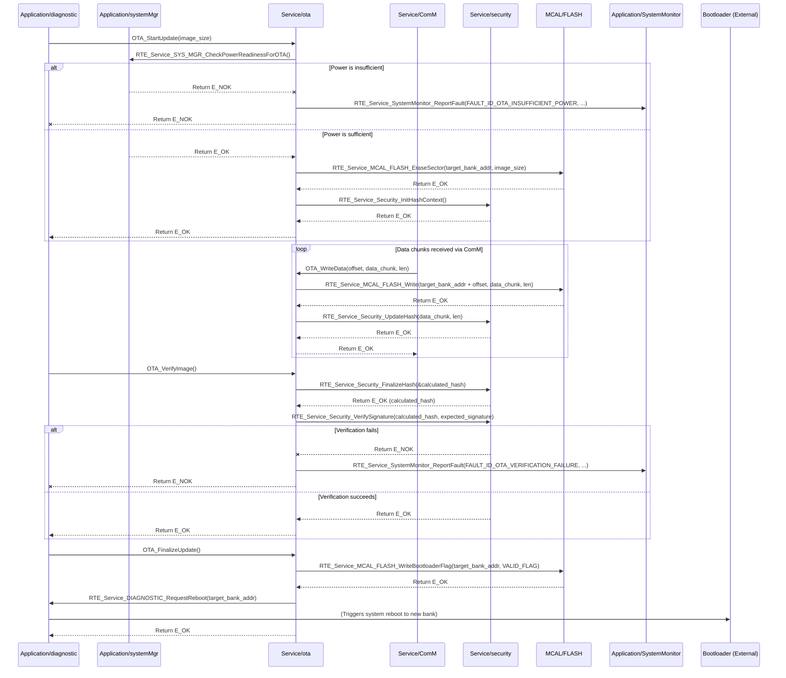

# **Detailed Design Document: OTA (Over-the-Air Update Service) Component**

## **1. Introduction**

### **1.1. Purpose**

This document details the design of the OTA component. Its primary purpose is to manage the **Over-the-Air (OTA) firmware update process**, enabling the smart device to receive and install new firmware images remotely. It handles the download, verification, and flashing of new firmware to the inactive Flash memory bank. This fulfills requirements like SRS-04-02-01 (OTA via Bluetooth and Modbus/Wi-Fi), SRS-04-02-02 (write to inactive bank), SRS-04-02-03 (switch to updated bank), SRS-04-02-04 (secure update process), and SRS-04-02-05 (prevent OTA if power is insufficient).

### **1.2. Scope**

The scope of this document covers the OTA module's architecture, functional behavior, interfaces, dependencies, and resource considerations. It details how OTA interacts with the ComM module for data reception, the security module for verification, MCAL_FLASH for writing, and diagnostic for initiation and reboot.

### **1.3. References**

* Software Architecture Document (SAD) - Environmental Monitoring & Control System (Final Version)  
* System Requirements Specification (SyRS) - Environmental Monitoring & Control System (Updated)  
* Software Requirements Specification (SRS) - Environmental Monitoring & Control System (Updated)  
* Detailed Design Document: RTE  
* Detailed Design Document: ComM  
* Detailed Design Document: security  
* Detailed Design Document: MCAL_FLASH  
* Detailed Design Document: diagnostic  
* Detailed Design Document: systemMgr  
* MCU Flash Memory Map / Bootloader Specification

## **2. Functional Description**

The OTA component provides the following core functionalities:

1. **Initialization (OTA_Init)**: Initialize internal state variables and prepare for potential update operations.  
2. **Initiate Update (OTA_StartUpdate)**: Begin the OTA process. This function is typically called by diagnostic after receiving an external command and verifying power readiness. It prepares the target Flash bank.  
3. **Receive Data (OTA_WriteData)**: Receive chunks of the new firmware image from the communication manager (ComM) and write them to the designated inactive Flash memory bank.  
4. **Verify Image (OTA_VerifyImage)**: After the entire image is received, perform integrity checks (CRC, cryptographic hash) and signature verification (using security module) to ensure the image is valid and uncorrupted.  
5. **Finalize Update (OTA_FinalizeUpdate)**: Mark the new firmware image as valid for the bootloader and request a system reboot to switch to the new application bank.  
6. **Cancel Update (OTA_CancelUpdate)**: Abort an ongoing update process, clean up temporary data, and revert to the previous state.  
7. **Status Reporting**: Provide the current OTA status (idle, downloading, verifying, error) and progress to diagnostic for external querying.  
8. **Error Reporting**: Report any failures during the OTA process (e.g., download timeout, verification failure, Flash write error, power insufficient) to the SystemMonitor via RTE_Service_SystemMonitor_ReportFault().

## **3. Non-Functional Requirements**

### **3.1. Performance**

* **Download Speed**: The OTA process shall be efficient enough to complete firmware downloads within a reasonable timeframe, depending on the communication interface (Bluetooth/Wi-Fi).  
* **Flash Write Speed**: Flash write operations shall be optimized to minimize the time the system is vulnerable or unresponsive during the flashing process.  
* **Verification Speed**: Image verification shall be performed quickly to minimize system downtime.

### **3.2. Memory**

* **Efficient Buffer Management**: Efficient use of temporary buffers for receiving firmware chunks before writing to Flash.  
* **Minimal RAM Footprint**: The OTA module shall have a minimal RAM footprint for its internal state.  
* **Flash Partitioning**: Must strictly adhere to the defined Flash memory partitioning (SRS-04-03-01) to ensure Bootloader, Factory App, and Application A/B regions are respected.

### **3.3. Reliability**

* **Robustness**: The module shall be robust against communication errors, power loss during download/flashing, and invalid firmware images.  
* **Data Integrity**: Must ensure the integrity of the downloaded firmware image through checksums and cryptographic hashes (SRS-04-02-04).  
* **Rollback Capability**: In case of a failed update or corrupted image, the system must be able to revert to a previously known good firmware version (handled by the Bootloader, but OTA must not corrupt the active bank).  
* **Security**: Must verify signed images and prevent unauthorized updates (SRS-04-02-04).  
* **Power Awareness**: Must prevent OTA if power is insufficient (SRS-04-02-05).

## **4. Architectural Context**

As per the SAD (Section 3.1.2, Service Layer), OTA resides in the Service Layer. It is responsible for managing the firmware update process. It is initiated by diagnostic (after systemMgr confirms power readiness) and interacts with ComM for data transfer, security for image verification, and MCAL_FLASH for writing to non-volatile memory. It also requests system reboots via diagnostic.

## **5. Design Details**

### **5.1. Module Structure**

The OTA component will consist of the following files:

* Service/ota/inc/ota.h: Public header file containing function prototypes, OTA states, and error codes.  
* Service/ota/src/ota.c: Source file containing the implementation of OTA logic, image verification, and Flash writing.  
* Service/ota/cfg/ota_cfg.h: Configuration header for Flash bank addresses, buffer sizes, and timeouts.

### **5.2. Public Interface (API)**
```c
// In Service/ota/inc/ota.h

#include "Application/common/inc/common.h" // For APP_Status_t  
#include <stdint.h>   // For uint32_t, uint8_t  
#include <stdbool.h>  // For bool

// --- OTA States ---  
typedef enum {  
    OTA_STATE_IDLE = 0,  
    OTA_STATE_INITIATING,  
    OTA_STATE_DOWNLOADING,  
    OTA_STATE_VERIFYING,  
    OTA_STATE_FINALIZING,  
    OTA_STATE_COMPLETE_SUCCESS,  
    OTA_STATE_ERROR,  
    OTA_STATE_COUNT  
} OTA_State_t;

// --- OTA Error Codes (specific to OTA module) ---  
typedef enum {  
    OTA_ERROR_NONE = 0,  
    OTA_ERROR_INVALID_PARAM,  
    OTA_ERROR_FLASH_WRITE_FAIL,  
    OTA_ERROR_VERIFICATION_FAIL,  
    OTA_ERROR_INSUFFICIENT_POWER,  
    OTA_ERROR_TIMEOUT,  
    OTA_ERROR_ALREADY_IN_PROGRESS,  
    OTA_ERROR_NOT_INITIATED,  
    // Add more specific errors as needed  
} OTA_ErrorCode_t;

/**  
 * @brief Initializes the OTA module.  
 * This function should be called once during system initialization.  
 * @return E_OK on success, E_NOK on failure.  
 */  
APP_Status_t OTA_Init(void);

/**  
 * @brief Starts the Over-the-Air update process.  
 * This function is typically called by the Diagnostic module.  
 * It checks power readiness and prepares the target Flash bank.  
 * @param image_size The total size of the new firmware image in bytes.  
 * @return E_OK if update initiated successfully, E_NOK on failure.  
 */  
APP_Status_t OTA_StartUpdate(uint32_t image_size);

/**  
 * @brief Writes a chunk of firmware data to the inactive Flash bank.  
 * This function is called repeatedly by ComM as data is received.  
 * @param offset The offset from the start of the image where this chunk belongs.  
 * @param data Pointer to the data buffer.  
 * @param len Length of the data chunk.  
 * @return E_OK on successful write, E_NOK on failure.  
 */  
APP_Status_t OTA_WriteData(uint32_t offset, const uint8_t *data, uint16_t len);

/**  
 * @brief Verifies the integrity and authenticity of the downloaded firmware image.  
 * This should be called after all data has been written.  
 * @return E_OK if image is valid, E_NOK on verification failure.  
 */  
APP_Status_t OTA_VerifyImage(void);

/**  
 * @brief Finalizes the OTA update, marking the new image as valid for the bootloader.  
 * This should be called after successful verification. It requests a system reboot.  
 * @return E_OK on success (reboot is imminent), E_NOK on failure.  
 */  
APP_Status_t OTA_FinalizeUpdate(void);

/**  
 * @brief Cancels an ongoing OTA update, cleaning up temporary data.  
 * @return E_OK on success, E_NOK if no update is in progress or cleanup fails.  
 */  
APP_Status_t OTA_CancelUpdate(void);

/**  
 * @brief Gets the current status of the OTA update process.  
 * @param state Pointer to store the current OTA state.  
 * @param progress_percent Pointer to store the download progress (0-100).  
 * @param error_code Pointer to store the last encountered OTA_ErrorCode_t.  
 * @return E_OK on success, E_NOK on failure (e.g., NULL pointer).  
 */  
APP_Status_t OTA_GetStatus(OTA_State_t *state, uint8_t *progress_percent, OTA_ErrorCode_t *error_code);
```
### **5.3. Internal Design**

The OTA module will manage the state machine for the update process, handle Flash memory interactions, and coordinate with ComM and security.

1. **Internal State Variables**:  
   ```c
   static OTA_State_t s_ota_current_state = OTA_STATE_IDLE;  
   static OTA_ErrorCode_t s_ota_last_error = OTA_ERROR_NONE;  
   static uint32_t s_ota_total_image_size = 0;  
   static uint32_t s_ota_bytes_received = 0;  
   static uint32_t s_ota_target_bank_address = 0; // Address of the inactive bank  
   static bool s_is_initialized = false;  
   // Pointers/handles for cryptographic context (e.g., hash context)
   ```
2. **Initialization (OTA_Init)**:  
   * Initialize s_ota_current_state = OTA_STATE_IDLE;, s_ota_last_error = OTA_ERROR_NONE;, etc.  
   * Perform any necessary setup for the MCAL_FLASH driver if it has specific OTA-related initializations.  
   * Initialize cryptographic contexts (e.g., for hashing) using RTE_Service_Security_InitHashContext().  
   * Set s_is_initialized = true;.  
   * Return E_OK.  
3. **Start Update (OTA_StartUpdate)**:  
   * If !s_is_initialized or s_ota_current_state != OTA_STATE_IDLE, report OTA_ERROR_ALREADY_IN_PROGRESS or OTA_ERROR_NOT_INITIATED and return E_NOK.  
   * Validate image_size (e.g., check against available Flash space).  
   * **Power Readiness Check (SRS-04-02-05)**:  
     * Call RTE_Service_SYS_MGR_CheckPowerReadinessForOTA().  
     * If E_NOK is returned (power insufficient), set s_ota_last_error = OTA_ERROR_INSUFFICIENT_POWER, report FAULT_ID_OTA_INSUFFICIENT_POWER to SystemMonitor, and return E_NOK.  
   * **Determine Target Bank**: Query the Bootloader (or a static map) to find the address of the inactive application bank (OTA_BANK_B_ADDRESS or OTA_BANK_C_ADDRESS).  
   * **Erase Target Bank**: Call RTE_Service_MCAL_FLASH_EraseSector(s_ota_target_bank_address, image_size). If this fails, set s_ota_last_error = OTA_ERROR_FLASH_WRITE_FAIL, report FAULT_ID_OTA_FLASH_ERASE_FAILURE, and return E_NOK.  
   * Reset s_ota_bytes_received = 0;.  
   * Set s_ota_total_image_size = image_size;.  
   * Set s_ota_current_state = OTA_STATE_INITIATING;.  
   * Log LOGI("OTA: Update initiated, target size %d bytes.", image_size);.  
   * Return E_OK.  
4. **Write Data (OTA_WriteData)**:  
   * If s_ota_current_state != OTA_STATE_INITIATING and s_ota_current_state != OTA_STATE_DOWNLOADING, set s_ota_last_error = OTA_ERROR_NOT_INITIATED and return E_NOK.  
   * Validate offset, data, len (e.g., ensure offset + len does not exceed s_ota_total_image_size).  
   * **Write to Flash**: Call RTE_Service_MCAL_FLASH_Write(s_ota_target_bank_address + offset, data, len). If this fails, set s_ota_last_error = OTA_ERROR_FLASH_WRITE_FAIL, report FAULT_ID_OTA_FLASH_WRITE_FAILURE, transition to OTA_STATE_ERROR, and return E_NOK.  
   * **Update Hash/CRC Context**: Call RTE_Service_Security_UpdateHash(data, len) to feed data into the cryptographic hash calculation.  
   * Update s_ota_bytes_received += len;.  
   * Set s_ota_current_state = OTA_STATE_DOWNLOADING;.  
   * Log LOGD("OTA: Received %d bytes, total %d/%d.", len, s_ota_bytes_received, s_ota_total_image_size);.  
   * Return E_OK.  
5. **Verify Image (OTA_VerifyImage)**:  
   * If s_ota_current_state != OTA_STATE_DOWNLOADING or s_ota_bytes_received != s_ota_total_image_size, set s_ota_last_error = OTA_ERROR_NOT_INITIATED and return E_NOK.  
   * Set s_ota_current_state = OTA_STATE_VERIFYING;.  
   * **Finalize Hash/CRC**: Call RTE_Service_Security_FinalizeHash(&calculated_hash);.  
   * **Verify Signature/Hash (SRS-04-02-04)**:  
     * Retrieve expected hash/signature from the downloaded image metadata.  
     * Call RTE_Service_Security_VerifySignature(calculated_hash, expected_signature).  
     * If verification fails, set s_ota_last_error = OTA_ERROR_VERIFICATION_FAIL, report FAULT_ID_OTA_VERIFICATION_FAILURE, transition to OTA_STATE_ERROR, and return E_NOK.  
   * Log LOGI("OTA: Image verification successful.");.  
   * Return E_OK.  
6. **Finalize Update (OTA_FinalizeUpdate)**:  
   * If s_ota_current_state != OTA_STATE_VERIFYING, set s_ota_last_error = OTA_ERROR_NOT_INITIATED and return E_NOK.  
   * Set s_ota_current_state = OTA_STATE_FINALIZING;.  
   * **Mark Bank as Valid**: This involves writing a specific flag/metadata in Flash that the Bootloader will recognize as a valid new image. This is highly MCU/Bootloader specific. It might be a call like RTE_Service_MCAL_FLASH_WriteBootloaderFlag(s_ota_target_bank_address, OTA_VALID_FLAG);. If this fails, set s_ota_last_error = OTA_ERROR_FLASH_WRITE_FAIL, report FAULT_ID_OTA_FINALIZE_FAILURE, and return E_NOK.  
   * **Request Reboot**: Call RTE_Service_DIAGNOSTIC_RequestReboot(s_ota_target_bank_address); (assuming diagnostic handles the reboot and bank selection).  
   * Set s_ota_current_state = OTA_STATE_COMPLETE_SUCCESS;.  
   * Log LOGI("OTA: Update finalized. System rebooting to new firmware.");.  
   * Return E_OK.  
7. **Cancel Update (OTA_CancelUpdate)**:  
   * If s_ota_current_state == OTA_STATE_IDLE or s_ota_current_state == OTA_STATE_COMPLETE_SUCCESS, return E_NOK.  
   * Log LOGW("OTA: Update cancelled.");.  
   * Reset s_ota_bytes_received = 0;, s_ota_total_image_size = 0;.  
   * Set s_ota_current_state = OTA_STATE_IDLE;.  
   * Set s_ota_last_error = OTA_ERROR_NONE;.  
   * Return E_OK.  
8. **Get Status (OTA_GetStatus)**:  
   * Validate pointers.  
   * *state = s_ota_current_state;  
   * *progress_percent = (s_ota_total_image_size > 0) ? (uint8_t)((s_ota_bytes_received * 100) / s_ota_total_image_size) : 0;  
   * *error_code = s_ota_last_error;  
   * Return E_OK.

**Sequence Diagram (Example: OTA Update Flow):**

### **5.4. Dependencies**

* Application/common/inc/common.h: For APP_Status_t, E_OK/E_NOK.  
* Application/logger/inc/logger.h: For internal logging.  
* Rte/inc/Rte.h: For calling RTE_Service_SystemMonitor_ReportFault(), RTE_Service_MCAL_FLASH_EraseSector(), RTE_Service_MCAL_FLASH_Write(), RTE_Service_Security_InitHashContext(), RTE_Service_Security_UpdateHash(), RTE_Service_Security_FinalizeHash(), RTE_Service_Security_VerifySignature(), RTE_Service_DIAGNOSTIC_RequestReboot(), RTE_Service_SYS_MGR_CheckPowerReadinessForOTA().  
* Application/SystemMonitor/inc/system_monitor.h: For FAULT_ID_OTA_... definitions.  
* Service/security/inc/security.h: For cryptographic services.  
* Mcal/flash/inc/mcal_flash.h: For low-level Flash memory access.  
* Application/diagnostic/inc/diagnostic.h: For DIAGNOSTIC_RequestReboot().  
* Application/systemMgr/inc/sys_mgr.h: For SYS_MGR_CheckPowerReadinessForOTA().  
* Service/ota/cfg/ota_cfg.h: For configuration parameters.

### **5.5. Error Handling**

* **Input Validation**: All public API functions will validate input parameters.  
* **Power Insufficiency (SRS-04-02-05)**: OTA_StartUpdate explicitly checks power readiness via systemMgr. If insufficient, it reports OTA_ERROR_INSUFFICIENT_POWER and FAULT_ID_OTA_INSUFFICIENT_POWER.  
* **Flash Operation Failures**: Any failure during MCAL_FLASH_EraseSector or MCAL_FLASH_Write will result in OTA_ERROR_FLASH_WRITE_FAIL, FAULT_ID_OTA_FLASH_ERASE/WRITE_FAILURE, and a transition to OTA_STATE_ERROR.  
* **Image Verification Failure (SRS-04-02-04)**: If OTA_VerifyImage fails (due to invalid CRC/hash or signature mismatch), OTA_ERROR_VERIFICATION_FAIL and FAULT_ID_OTA_VERIFICATION_FAILURE are reported, and the state transitions to OTA_STATE_ERROR. The Bootloader's role is then to detect this invalid image and fall back.  
* **Timeout**: While not explicitly shown in OTA_WriteData, ComM or higher layers should implement timeouts for receiving data. If OTA doesn't receive data within a certain period, diagnostic might call OTA_CancelUpdate.  
* **Fault Reporting**: All critical errors are reported to SystemMonitor via RTE_Service_SystemMonitor_ReportFault().  
* **State Management**: The s_ota_current_state variable tracks the process, preventing operations in invalid states.  
* **Return Status**: All public API functions return E_NOK on failure.

### **5.6. Configuration**

The Service/ota/cfg/ota_cfg.h file will contain:

* OTA_BANK_A_ADDRESS, OTA_BANK_B_ADDRESS, OTA_BANK_C_ADDRESS: Flash addresses for the application banks as per SRS-04-03-01.  
* OTA_MAX_IMAGE_SIZE: Maximum supported firmware image size.  
* OTA_CHUNK_SIZE: Optimal size for data chunks received from ComM.  
* OTA_BOOTLOADER_VALID_FLAG_OFFSET: Offset within the bank where the bootloader's valid image flag is stored.  
* OTA_BOOTLOADER_VALID_FLAG_VALUE: The specific value to write to mark a bank as valid.
```c
// Example: Service/ota/cfg/ota_cfg.h  
#ifndef OTA_CFG_H  
#define OTA_CFG_H

// Flash memory partitioning (as per SRS-04-03-01)  
#define OTA_BOOTLOADER_ADDRESS          0x00000000 // Example: Start of bootloader  
#define OTA_FACTORY_APP_ADDRESS         0x00100000 // Example: Start of Factory App (Bank A)  
#define OTA_APP_A_ADDRESS               0x00200000 // Example: Start of Application A (Bank B)  
#define OTA_APP_B_ADDRESS               0x00400000 // Example: Start of Application B (Bank C)

// Maximum supported firmware image size (adjust based on Flash partition size)  
#define OTA_MAX_IMAGE_SIZE              0x00200000 // 2MB example

// Optimal chunk size for writing data received from ComM  
#define OTA_CHUNK_SIZE                  4096 // 4KB

// Bootloader-specific flags/offsets for marking valid images  
#define OTA_BOOTLOADER_VALID_FLAG_OFFSET 0x00000000 // Example offset within the bank's metadata area  
#define OTA_BOOTLOADER_VALID_FLAG_VALUE  0xDEADBEEF // Example magic value

#endif // OTA_CFG_H
```
### **5.7. Resource Usage**

* **Flash**: Moderate, for the module's code and internal logic.  
* **RAM**: Moderate, primarily for the internal receive buffer (OTA_CHUNK_SIZE) and cryptographic hash contexts.  
* **CPU**: High during OTA_VerifyImage (for hash calculation and signature verification) and OTA_WriteData (for Flash writes). These operations are typically blocking or semi-blocking, but infrequent.

## **6. Test Considerations**

### **6.1. Unit Testing**

* **Mock Dependencies**: Unit tests for OTA will mock RTE_Service_SystemMonitor_ReportFault(), RTE_Service_MCAL_FLASH_EraseSector(), RTE_Service_MCAL_FLASH_Write(), RTE_Service_Security_InitHashContext(), RTE_Service_Security_UpdateHash(), RTE_Service_Security_FinalizeHash(), RTE_Service_Security_VerifySignature(), RTE_Service_DIAGNOSTIC_RequestReboot(), RTE_Service_SYS_MGR_CheckPowerReadinessForOTA().  
* **Test Cases**:  
  * OTA_Init: Verify internal state initialization and security service calls.  
  * OTA_StartUpdate:  
    * Test with valid/invalid image_size.  
    * Test when already in progress.  
    * Mock SYS_MGR_CheckPowerReadinessForOTA() to return insufficient power (verify E_NOK and fault).  
    * Mock MCAL_FLASH_EraseSector() failure (verify E_NOK and fault).  
    * Verify state transitions to OTA_STATE_INITIATING.  
  * OTA_WriteData:  
    * Test writing valid chunks, ensuring MCAL_FLASH_Write and Security_UpdateHash are called.  
    * Test offset and len boundary conditions (start, end, middle).  
    * Test MCAL_FLASH_Write failure (verify E_NOK, fault, state OTA_STATE_ERROR).  
    * Test calling before OTA_StartUpdate.  
    * Verify s_ota_bytes_received and progress_percent update correctly.  
  * OTA_VerifyImage:  
    * Test successful verification (mock Security_VerifySignature to return E_OK).  
    * Test failed verification (mock Security_VerifySignature to return E_NOK, verify E_NOK, fault, state OTA_STATE_ERROR).  
    * Test calling before all data is received.  
  * OTA_FinalizeUpdate:  
    * Test successful finalization (mock MCAL_FLASH_WriteBootloaderFlag and DIAGNOSTIC_RequestReboot).  
    * Test MCAL_FLASH_WriteBootloaderFlag failure.  
    * Test calling before verification.  
  * OTA_CancelUpdate: Test cancelling at various stages (downloading, verifying, error). Verify state resets.  
  * OTA_GetStatus: Verify it returns correct state, progress, and error code.

### **6.2. Integration Testing**

* **OTA-ComM Integration**: Simulate receiving firmware chunks via ComM (e.g., using a mocked ComM or actual communication). Verify OTA_WriteData processes them correctly.  
* **OTA-security Integration**: Ensure the OTA module correctly uses the security module for hashing and signature verification. Test with valid and invalid signed images.  
* **OTA-MCAL_FLASH Integration**: Verify OTA can successfully erase and write to the designated Flash banks. Use a test image to flash.  
* **OTA-diagnostic/systemMgr Integration**: Verify diagnostic can initiate OTA, systemMgr correctly checks power, and diagnostic can request reboot.  
* **Power Loss Resilience**: Simulate power loss during download and during flashing. Verify the system's ability to recover (Bootloader's role) and that the active application remains uncorrupted.  
* **Full Update Cycle**: Perform an end-to-end OTA update using a real communication interface (Bluetooth/Wi-Fi) and verify the new firmware is successfully installed and boots.

### **6.3. System Testing**

* **End-to-End OTA**: Conduct full system OTA updates using various communication interfaces and different firmware versions. Verify successful updates, fallback mechanisms, and secure boot.  
* **Stress Testing**: Perform multiple consecutive OTA updates.  
* **Power Condition Testing**: Test OTA initiation under marginal power conditions to confirm SRS-04-02-05 is met.  
* **Security Testing**: Attempt to flash unsigned or maliciously modified firmware images to ensure the security module correctly rejects them.  
* **Long-Term Reliability**: Monitor system stability after OTA updates over extended periods.