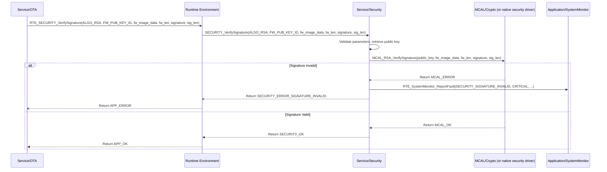

# **Detailed Design Document: Security Component**

## **1. Introduction**

### **1.1. Purpose**

This document details the design of the Security component, which resides in the Service Layer. Its primary purpose is to provide cryptographic services, secure communication mechanisms, and key management functionalities to other modules within the system. It aims to ensure data integrity, confidentiality, and authenticity for sensitive operations like communication and firmware updates, abstracting the complexities of cryptographic primitives and secure storage.

### **1.2. Scope**

The scope of this document covers the Security module's architecture, functional behavior, interfaces, dependencies, and resource considerations. It details how Security provides services to ComM (for secure communication), OTA (for firmware verification), and Application/storage (for secure data storage).

### **1.3. References**

* Software Architecture Document (SAD) - Smart Device Firmware (Final Version)  
* Detailed Design Document: ComM  
* Detailed Design Document: OTA  
* Detailed Design Document: Application/storage (Conceptual)  
* MCU Cryptographic Accelerators Documentation (if applicable)  
* Industry Best Practices for Embedded Security (Conceptual)

## **2. Functional Description**

The Security component provides the following core functionalities:

1. **Security Initialization**: Initialize cryptographic hardware accelerators (if available) and secure storage.  
2. **Data Encryption/Decryption**: Encrypt and decrypt data blocks using symmetric (e.g., AES) or asymmetric (e.g., RSA) algorithms.  
3. **Hashing/Checksumming**: Generate cryptographic hashes (e.g., SHA-256) or secure checksums for data integrity verification.  
4. **Digital Signature Verification**: Verify digital signatures of firmware images or data packets to ensure authenticity and integrity.  
5. **Key Management**: Securely store, retrieve, and manage cryptographic keys (e.g., private keys for signing, symmetric keys for encryption). This might involve hardware-backed secure storage.  
6. **Random Number Generation**: Provide a source of cryptographically secure random numbers.  
7. **Secure Communication Channel Setup**: Assist ComM in setting up secure communication channels (e.g., TLS for Wi-Fi, BLE pairing/encryption).  
8. **Error Reporting**: Report any failures during security operations (e.g., cryptographic failure, key corruption, invalid signature) to the SystemMonitor via RTE_SystemMonitor_ReportFault().

## **3. Non-Functional Requirements**

### **3.1. Performance**

* **Cryptographic Speed**: Perform cryptographic operations efficiently, especially for high-throughput communication or large firmware updates.  
* **Randomness**: Ensure the quality and unpredictability of generated random numbers.

### **3.2. Memory**

* **Minimal Footprint**: The Security code and data shall have a minimal memory footprint.  
* **Secure Storage**: Keys and sensitive data must be stored in a tamper-resistant manner (e.g., dedicated secure element, encrypted Flash regions).

### **3.3. Reliability**

* **Robustness**: The module shall handle invalid inputs or cryptographic failures gracefully.  
* **Tamper Detection**: Ideally, detect and respond to attempts to tamper with keys or secure data.  
* **Compliance**: Adhere to relevant security standards and best practices for embedded systems.

## **4. Architectural Context**

As per the SAD (Section 3.1.2, Service Layer), Security resides in the Service Layer. It provides foundational security services to other Service layer modules (ComM, OTA) and potentially Application layer modules (Application/storage). It leverages MCU-specific cryptographic hardware (if available) or software libraries.

## **5. Design Details**

### **5.1. Module Structure**

The Security component will consist of the following files:

* Service/security/inc/security.h: Public header file containing function prototypes, data types, and error codes.  
* Service/security/src/security.c: Source file containing the implementation of the Security functions.  
* Service/security/cfg/security_cfg.h: Configuration header for enabling/disabling specific algorithms, key storage locations.

### **5.2. Public Interface (API)**

// In Service/security/inc/security.h
```c
// Enum for Security status/error codes  
typedef enum {  
    SECURITY_OK = 0,  
    SECURITY_ERROR_INIT_FAILED,  
    SECURITY_ERROR_ENCRYPT_FAILED,  
    SECURITY_ERROR_DECRYPT_FAILED,  
    SECURITY_ERROR_HASH_FAILED,  
    SECURITY_ERROR_SIGNATURE_INVALID,  
    SECURITY_ERROR_KEY_NOT_FOUND,  
    SECURITY_ERROR_INVALID_PARAM,  
    // Add more specific errors as needed  
} SECURITY_Status_t;

// Enum for cryptographic algorithms  
typedef enum {  
    SECURITY_ALGO_AES128_CBC,  
    SECURITY_ALGO_AES256_CBC,  
    SECURITY_ALGO_SHA256,  
    SECURITY_ALGO_RSA2048_PKCS1_V1_5,  
    // Add more algorithms as needed  
} SECURITY_Algorithm_t;

// Enum for key IDs (logical identifiers for stored keys)  
typedef enum {  
    SECURITY_KEY_ID_FW_UPDATE_PUB_KEY, // Public key for firmware verification  
    SECURITY_KEY_ID_COMM_SYM_KEY,      // Symmetric key for communication  
    // Add more key IDs as needed  
} SECURITY_KeyId_t;

/**  
 * @brief Initializes the Security module.  
 * This function should be called once during system initialization.  
 * @return SECURITY_OK on success, an error code on failure.  
 */  
SECURITY_Status_t SECURITY_Init(void);

/**  
 * @brief Encrypts data using a specified algorithm and key.  
 * @param algo The encryption algorithm to use.  
 * @param key_id The ID of the key to use for encryption.  
 * @param plaintext Pointer to the data to encrypt.  
 * @param plaintext_len Length of the plaintext data.  
 * @param ciphertext_buffer Pointer to the buffer to store encrypted data.  
 * @param ciphertext_buffer_len Size of the ciphertext buffer.  
 * @param actual_ciphertext_len Pointer to store the actual length of encrypted data.  
 * @return SECURITY_OK on success, an error code on failure.  
 */  
SECURITY_Status_t SECURITY_Encrypt(SECURITY_Algorithm_t algo,  
                                                   SECURITY_KeyId_t key_id,  
                                                   const uint8_t *plaintext, uint32_t plaintext_len,  
                                                   uint8_t *ciphertext_buffer, uint32_t ciphertext_buffer_len,  
                                                   uint32_t *actual_ciphertext_len);

/**  
 * @brief Decrypts data using a specified algorithm and key.  
 * @param algo The decryption algorithm to use.  
 * @param key_id The ID of the key to use for decryption.  
 * @param ciphertext Pointer to the data to decrypt.  
 * @param ciphertext_len Length of the ciphertext data.  
 * @param plaintext_buffer Pointer to the buffer to store decrypted data.  
 * @param plaintext_buffer_len Size of the plaintext buffer.  
 * @param actual_plaintext_len Pointer to store the actual length of decrypted data.  
 * @return SECURITY_OK on success, an error code on failure.  
 */  
SECURITY_Status_t SECURITY_Decrypt(SECURITY_Algorithm_t algo,  
                                                   SECURITY_KeyId_t key_id,  
                                                   const uint8_t *ciphertext, uint32_t ciphertext_len,  
                                                   uint8_t *plaintext_buffer, uint32_t plaintext_buffer_len,  
                                                   uint32_t *actual_plaintext_len);

/**  
 * @brief Generates a cryptographic hash of data.  
 * @param algo The hashing algorithm to use (e.g., SHA256).  
 * @param data Pointer to the data to hash.  
 * @param data_len Length of the data.  
 * @param hash_buffer Pointer to the buffer to store the hash.  
 * @param hash_buffer_len Size of the hash buffer.  
 * @return SECURITY_OK on success, an error code on failure.  
 */  
SECURITY_Status_t SECURITY_GenerateHash(SECURITY_Algorithm_t algo,  
                                                        const uint8_t *data, uint32_t data_len,  
                                                        uint8_t *hash_buffer, uint32_t hash_buffer_len);

/**  
 * @brief Verifies a digital signature.  
 * @param algo The signature algorithm (e.g., RSA2048_PKCS1_V1_5).  
 * @param public_key_id The ID of the public key to use for verification.  
 * @param data Pointer to the original data that was signed.  
 * @param data_len Length of the original data.  
 * @param signature Pointer to the signature to verify.  
 * @param signature_len Length of the signature.  
 * @return SECURITY_OK if signature is valid, SECURITY_ERROR_SIGNATURE_INVALID otherwise.  
 */  
SECURITY_Status_t SECURITY_VerifySignature(SECURITY_Algorithm_t algo,  
                                                           SECURITY_KeyId_t public_key_id,  
                                                           const uint8_t *data, uint32_t data_len,  
                                                           const uint8_t *signature, uint32_t signature_len);

/**  
 * @brief Generates a cryptographically secure random number.  
 * @param buffer Pointer to the buffer to store the random bytes.  
 * @param len Number of random bytes to generate.  
 * @return SECURITY_OK on success, an error code on failure.  
 */  
SECURITY_Status_t SECURITY_GenerateRandom(uint8_t *buffer, uint32_t len);

// Add functions for secure key provisioning, secure boot integration (if needed)
```

### **5.3. Internal Design**

The Security module will leverage MCU-specific cryptographic hardware accelerators (if available) via MCAL or vendor-provided low-level security drivers. Otherwise, it will use well-vetted software cryptographic libraries. Key management will involve secure storage mechanisms.

1. **Initialization (SECURITY_Init)**:  
   * Initialize any underlying cryptographic hardware (e.g., MCAL_CRYPTO_Init()).  
   * Load any static/pre-provisioned keys (e.g., firmware update public key) from secure storage (e.g., MCAL_FLASH_Read from a secure partition, or a dedicated secure element driver).  
   * Perform self-tests of cryptographic modules.  
   * If any initialization or key loading fails, report SECURITY_ERROR_INIT_FAILED to SystemMonitor.  
   * Return SECURITY_OK.  
2. **Encryption/Decryption (SECURITY_Encrypt, SECURITY_Decrypt)**:  
   * Validate algo, key_id, input/output buffers.  
   * Retrieve the appropriate key from internal key storage based on key_id.  
   * Call the underlying cryptographic primitive (e.g., MCAL_AES_Encrypt(), software_aes_encrypt()).  
   * Handle padding, IV generation/usage as required by the algorithm.  
   * Report SECURITY_ERROR_ENCRYPT_FAILED/DECRYPT_FAILED or SECURITY_ERROR_KEY_NOT_FOUND if operations fail.  
3. **Hashing (SECURITY_GenerateHash)**:  
   * Validate algo, data, data_len, hash_buffer.  
   * Call the underlying hashing primitive (e.g., MCAL_SHA256_Hash(), software_sha256_hash()).  
   * Report SECURITY_ERROR_HASH_FAILED if operation fails.  
4. **Signature Verification (SECURITY_VerifySignature)**:  
   * Validate algo, public_key_id, data, signature.  
   * Retrieve the public key.  
   * Call the underlying signature verification primitive (e.g., MCAL_RSA_VerifySignature(), software_rsa_verify_signature()). This typically involves hashing the data first, then verifying the signature against the hash.  
   * Report SECURITY_ERROR_SIGNATURE_INVALID or SECURITY_ERROR_KEY_NOT_FOUND if verification fails.  
5. **Random Number Generation (SECURITY_GenerateRandom)**:  
   * Validate buffer, len.  
   * Call the underlying True Random Number Generator (TRNG) or Cryptographically Secure Pseudo-Random Number Generator (CSPRNG) (e.g., MCAL_TRNG_Generate()).  
   * Report SECURITY_ERROR_INIT_FAILED (if TRNG not available/initialized) or other errors.

**Sequence Diagram (Example: OTA Module Verifies Firmware Signature):**


### **5.4. Dependencies**

* **MCAL Cryptographic Drivers**: (e.g., Mcal/crypto/inc/mcal_crypto.h) for hardware accelerators.  
* **Software Cryptographic Libraries**: If hardware acceleration is not available or insufficient (e.g., mbedTLS, tinycrypt).  
* **Application/logger/inc/logger.h**: For internal logging.  
* **Rte/inc/Rte.h**: For calling RTE_SystemMonitor_ReportFault().  
* **Application/common/inc/app_common.h**: For APP_Status_t.  
* **Service/security/cfg/security_cfg.h**: For configuration.

### **5.5. Error Handling**

* **Input Validation**: All public API functions will validate input parameters.  
* **Underlying Driver/Library Error Propagation**: Errors returned by MCAL cryptographic drivers or software libraries will be caught by Security.  
* **Fault Reporting**: Upon detection of an error (e.g., cryptographic operation failure, invalid signature, key not found), Security will report a specific fault ID (e.g., SECURITY_ERROR_INIT_FAILED, SECURITY_ERROR_ENCRYPT_FAILED, SECURITY_ERROR_SIGNATURE_INVALID, SECURITY_ERROR_KEY_NOT_FOUND) to SystemMonitor via the RTE service.  
* **Return Status**: All public API functions will return SECURITY_Status_t indicating success or specific error.

### **5.6. Configuration**

The Service/security/cfg/security_cfg.h file will contain:

* Enable/disable flags for specific cryptographic algorithms.  
* Configuration for key storage (e.g., use hardware secure element, specific Flash partition).  
* Public key data for firmware verification (if stored in code).  
* Any other security-related parameters.
```c
// Example: Service/security/cfg/security_cfg.h  
#define SECURITY_ENABLE_AES         1  
#define SECURITY_ENABLE_SHA256      1  
#define SECURITY_ENABLE_RSA         1

// Key storage configuration  
#define SECURITY_KEY_STORAGE_HW_SECURE_ELEMENT 0 // 1 if using HW secure element, 0 for Flash  
#define SECURITY_FW_PUB_KEY_FLASH_ADDR         0x00008000 // Example Flash address for public key
```

### **5.7. Resource Usage**

* **Flash**: Moderate to high, depending on the number of algorithms implemented and the size of stored keys/certificates.  
* **RAM**: Moderate, for cryptographic contexts, buffers, and key material during operations.  
* **CPU**: Can be high for complex cryptographic operations (e.g., RSA signature verification) if not hardware accelerated. Minimal for hashing or symmetric encryption with hardware support.

## **6. Test Considerations**

### **6.1. Unit Testing**

* **Mock Underlying Crypto/Key Storage**: Unit tests for Security will mock underlying MCAL cryptographic drivers, secure element interfaces, or Flash read/write functions to isolate Security's logic.  
* **Test Cases**:  
  * SECURITY_Init: Verify initialization of underlying crypto, key loading, and self-tests. Test error propagation.  
  * SECURITY_Encrypt/Decrypt: Test with known plaintext/ciphertext pairs for enabled algorithms. Test valid/invalid keys, buffers, lengths.  
  * SECURITY_GenerateHash: Test with known data and expected hash values.  
  * SECURITY_VerifySignature: Test with valid and invalid signatures, data, and public keys.  
  * SECURITY_GenerateRandom: Test for randomness (statistical tests, not strictly unit testable but can check for non-zero output).  
  * Error reporting: Verify that RTE_SystemMonitor_ReportFault() is called with the correct fault ID on various error conditions.

### **6.2. Integration Testing**

* **Security-MCAL/Hardware Integration**: Verify that Security correctly interfaces with actual cryptographic hardware accelerators (if present).  
* **OTA Security Integration**: Perform OTA updates with signed/unsigned/corrupted firmware images and verify that Security correctly accepts/rejects them.  
* **Secure Communication Integration**: Integrate with ComM to establish secure communication channels (e.g., TLS, BLE encrypted link) and verify data confidentiality and integrity.  
* **Key Management**: Test the secure provisioning and retrieval of keys. If using a secure element, verify its functionality.  
* **Fault Injection**: Simulate cryptographic hardware failures or key corruption to verify Security's error handling and reporting.

### **6.3. System Testing**

* **End-to-End Security**: Verify that all security features (secure boot, firmware updates, communication) function correctly in the integrated system.  
* **Penetration Testing**: Conduct security audits and penetration tests to identify vulnerabilities.  
* **Long-Term Stability**: Run the system for extended periods under various operational conditions to ensure security features remain robust.  
* **Resource Impact**: Monitor CPU and RAM usage during cryptographic operations to ensure they don't negatively impact real-time performance.
