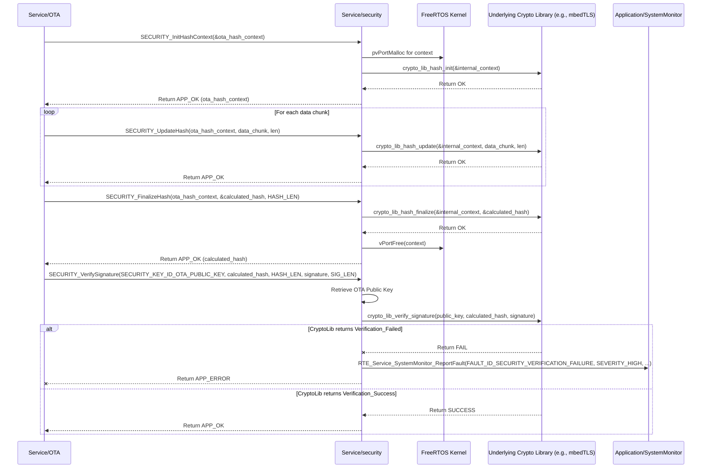

# **Detailed Design Document: Security Component**

## **1. Introduction**

### **1.1. Purpose**

This document details the design of the SECURITY component. Its primary purpose is to provide **cryptographic services and secure communication mechanisms** for the smart device firmware. It abstracts the complexities of cryptographic algorithms and hardware security modules (if available), offering a standardized interface for encryption, decryption, hashing, signature verification, and key management. This fulfills requirements like SRS-04-02-04 (secure OTA update process) and SRS-06-01-05 (all sensitive communication encrypted and authenticated).

### **1.2. Scope**

The scope of this document covers the SECURITY module's architecture, functional behavior, interfaces, dependencies, and resource considerations. It details how SECURITY provides services to ComM for secure communication, OTA for firmware image verification, and potentially Nvm for secure storage of sensitive data. It interacts with underlying MCAL/HAL cryptographic accelerators or software libraries.

### **1.3. References**

* Software Architecture Document (SAD) - Environmental Monitoring & Control System (Final Version)  
* Software Requirements Specification (SRS) - Environmental Monitoring & Control System (Updated)  
* Detailed Design Document: RTE  
* Detailed Design Document: ComM  
* Detailed Design Document: OTA  
* Detailed Design Document: Nvm (if used for key storage)  
* MCU Cryptographic Accelerator Datasheet (if applicable)  
* Cryptographic Library Documentation (e.g., mbedTLS, tinycrypt, or native SDK crypto APIs)

## **2. Functional Description**

The SECURITY component provides the following core functionalities:

1. **Initialization (SECURITY_Init)**: Initialize cryptographic hardware accelerators (if present) and software libraries, and perform any necessary self-tests.  
2. **Hashing (SECURITY_InitHashContext, SECURITY_UpdateHash, SECURITY_FinalizeHash)**: Provide an interface for calculating cryptographic hashes (e.g., SHA-256) of data streams, used for data integrity checks (e.g., for OTA firmware images).  
3. **Signature Verification (SECURITY_VerifySignature)**: Verify the digital signature of a hash or data block using a public key, ensuring authenticity and integrity (e.g., for signed firmware images).  
4. **Encryption (SECURITY_Encrypt)**: Encrypt data using a symmetric (e.g., AES) or asymmetric (e.g., RSA) algorithm.  
5. **Decryption (SECURITY_Decrypt)**: Decrypt data using the corresponding algorithm and key.  
6. **Authentication (SECURITY_Authenticate, SECURITY_AuthenticateAndDecrypt)**: Provide mechanisms for message authentication (e.g., HMAC) or combined authentication and decryption.  
7. **Key Management (Basic)**: Securely store and retrieve cryptographic keys (e.g., public keys for signature verification, symmetric keys for communication sessions). This might involve interaction with Nvm or dedicated secure storage hardware.  
8. **Random Number Generation (SECURITY_GenerateRandom)**: Provide a cryptographically secure pseudo-random number generator (CSPRNG).  
9. **Error Reporting**: Report any failures during cryptographic operations (e.g., hardware accelerator error, verification mismatch, invalid key) to the SystemMonitor via RTE_Service_SystemMonitor_ReportFault().

## **3. Non-Functional Requirements**

### **3.1. Performance**

* **Speed**: Cryptographic operations (especially hashing, encryption/decryption for communication and OTA) shall be performed efficiently to minimize latency and maximize throughput. Hardware acceleration should be leveraged if available.  
* **Minimal Latency**: Operations should not introduce significant delays in critical data paths.

### **3.2. Memory**

* **Minimal Footprint**: The SECURITY module code and data shall have a minimal memory footprint.  
* **Buffer Management**: Efficient use of internal buffers for cryptographic operations.  
* **Secure Storage**: Keys and other sensitive data must be stored securely, preventing unauthorized access or modification.

### **3.3. Reliability**

* **Robustness**: The module shall be robust against invalid inputs, key corruption, or hardware failures, preventing system crashes.  
* **Integrity**: Cryptographic operations must correctly detect data tampering.  
* **Authenticity**: Signature verification must reliably confirm the origin of data.  
* **Confidentiality**: Encrypted data must remain confidential.  
* **Side-Channel Attack Resistance (Advanced)**: While not a primary requirement for initial design, consideration for basic resistance against side-channel attacks (e.g., timing attacks) should be noted for future enhancements.

## **4. Architectural Context**

As per the SAD (Section 3.1.2, Service Layer), SECURITY resides in the Service Layer. It provides cryptographic services to other Service Layer modules (ComM, OTA) and potentially Application Layer modules (e.g., diagnostic for secure logging, Nvm for secure configuration storage) via RTE services. It interacts with underlying MCAL/HAL drivers for cryptographic accelerators or directly with integrated crypto libraries.

## **5. Design Details**

### **5.1. Module Structure**

The SECURITY component will consist of the following files:

* Service/security/inc/security.h: Public header file containing function prototypes, data types (e.g., hash contexts, key IDs), and error codes.  
* Service/security/src/security.c: Source file containing the implementation of cryptographic functions, wrapping underlying crypto libraries or hardware accelerators.  
* Service/security/cfg/security_cfg.h: Configuration header for algorithm selection, key storage locations, and buffer sizes.

### **5.2. Public Interface (API)**
```c
// In Service/security/inc/security.h

#include "Application/common/inc/app_common.h" // For APP_Status_t  
#include <stdint.h>   // For uint32_t, uint8_t  
#include <stdbool.h>  // For bool

// --- Hash Context (Opaque type for caller) ---  
typedef void *SECURITY_HashContext_t;

// --- Key ID Definitions (for stored keys) ---  
typedef enum {  
    SECURITY_KEY_ID_OTA_PUBLIC_KEY = 0, // Public key for verifying OTA firmware signatures  
    SECURITY_KEY_ID_COMM_SESSION_KEY,   // Symmetric session key for secure communication  
    // Add more key IDs as needed  
    SECURITY_KEY_ID_COUNT  
} SECURITY_KeyId_t;

// --- Public Functions ---

/**  
 * @brief Initializes the Security module, including cryptographic hardware/libraries.  
 * @return APP_OK on success, APP_ERROR on failure.  
 */  
APP_Status_t SECURITY_Init(void);

// --- Hashing Functions (e.g., SHA-256) ---

/**  
 * @brief Initializes a new hash calculation context.  
 * @param context Pointer to a SECURITY_HashContext_t to initialize.  
 * @return APP_OK on success, APP_ERROR on failure.  
 */  
APP_Status_t SECURITY_InitHashContext(SECURITY_HashContext_t *context);

/**  
 * @brief Updates the hash calculation with a new chunk of data.  
 * @param context The hash context.  
 * @param data Pointer to the data to hash.  
 * @param len Length of the data.  
 * @return APP_OK on success, APP_ERROR on failure.  
 */  
APP_Status_t SECURITY_UpdateHash(SECURITY_HashContext_t context, const uint8_t *data, uint32_t len);

/**  
 * @brief Finalizes the hash calculation and retrieves the result.  
 * The context should be freed/invalidated after this.  
 * @param context The hash context.  
 * @param hash_output Buffer to store the resulting hash.  
 * @param output_len The expected length of the hash output (e.g., 32 for SHA-256).  
 * @return APP_OK on success, APP_ERROR on failure.  
 */  
APP_Status_t SECURITY_FinalizeHash(SECURITY_HashContext_t context, uint8_t *hash_output, uint32_t output_len);

// --- Signature Verification ---

/**  
 * @brief Verifies a digital signature against a calculated hash using a stored public key.  
 * @param key_id The ID of the public key to use for verification (e.g., SECURITY_KEY_ID_OTA_PUBLIC_KEY).  
 * @param hash_to_verify The hash that was signed.  
 * @param hash_len Length of the hash.  
 * @param signature The digital signature to verify.  
 * @param signature_len Length of the signature.  
 * @return APP_OK if signature is valid, APP_ERROR if invalid or on failure.  
 */  
APP_Status_t SECURITY_VerifySignature(SECURITY_KeyId_t key_id,  
                                      const uint8_t *hash_to_verify, uint32_t hash_len,  
                                      const uint8_t *signature, uint32_t signature_len);

// --- Encryption/Decryption/Authentication (simplified for illustration) ---

/**  
 * @brief Encrypts and optionally authenticates data using a specified key.  
 * @param key_id The ID of the key to use (e.g., SECURITY_KEY_ID_COMM_SESSION_KEY).  
 * @param plaintext Input data to encrypt.  
 * @param plaintext_len Length of plaintext.  
 * @param ciphertext_output Buffer for encrypted data.  
 * @param ciphertext_len_ptr Pointer to store the length of encrypted data.  
 * @param auth_tag_output Optional buffer for authentication tag (e.g., for AEAD modes).  
 * @param auth_tag_len_ptr Optional pointer to store auth tag length.  
 * @return APP_OK on success, APP_ERROR on failure.  
 */  
APP_Status_t SECURITY_Encrypt(SECURITY_KeyId_t key_id,  
                              const uint8_t *plaintext, uint32_t plaintext_len,  
                              uint8_t *ciphertext_output, uint32_t *ciphertext_len_ptr,  
                              uint8_t *auth_tag_output, uint32_t *auth_tag_len_ptr);

/**  
 * @brief Authenticates and decrypts data using a specified key.  
 * @param key_id The ID of the key to use.  
 * @param ciphertext Input encrypted data.  
 * @param ciphertext_len Length of ciphertext.  
 * @param auth_tag Input authentication tag (if applicable).  
 * @param auth_tag_len Length of auth tag.  
 * @param plaintext_output Buffer for decrypted data.  
 * @param plaintext_len_ptr Pointer to store the length of decrypted data.  
 * @return APP_OK on successful authentication and decryption, APP_ERROR on failure (e.g., invalid tag, decryption error).  
 */  
APP_Status_t SECURITY_AuthenticateAndDecrypt(SECURITY_KeyId_t key_id,  
                                             const uint8_t *ciphertext, uint32_t ciphertext_len,  
                                             const uint8_t *auth_tag, uint32_t auth_tag_len,  
                                             uint8_t *plaintext_output, uint32_t *plaintext_len_ptr);

/**  
 * @brief Generates a cryptographically secure random number.  
 * @param buffer Pointer to the buffer to fill with random bytes.  
 * @param len Number of bytes to generate.  
 * @return APP_OK on success, APP_ERROR on failure.  
 */  
APP_Status_t SECURITY_GenerateRandom(uint8_t *buffer, uint32_t len);
```
### **5.3. Internal Design**

The SECURITY module will wrap a chosen cryptographic library (e.g., mbedTLS, tinycrypt, or native ESP-IDF crypto APIs) and manage key material.

1. **Internal State**:  
   * s_is_initialized = false;  
   * Internal structures for cryptographic contexts (e.g., mbedtls_sha256_context_t).  
   * Key storage: A secure array or mechanism to hold keys. Public keys can be hardcoded or stored in NVM. Symmetric session keys might be generated or exchanged during secure connection setup.  
2. **Initialization (SECURITY_Init)**:  
   * Initialize the chosen cryptographic library (e.g., mbedtls_platform_setup(), esp_crypto_init()).  
   * Perform any necessary self-tests for the crypto hardware/library.  
   * Load any persistent keys (e.g., SECURITY_KEY_ID_OTA_PUBLIC_KEY) from Nvm or internal Flash.  
   * If any step fails, report FAULT_ID_SECURITY_INIT_FAILURE to SystemMonitor and return APP_ERROR.  
   * Set s_is_initialized = true;.  
   * Return APP_OK.  
3. **Hashing (SECURITY_InitHashContext, SECURITY_UpdateHash, SECURITY_FinalizeHash)**:  
   * These functions will directly wrap the chosen library's hash API (e.g., mbedtls_sha256_init(), mbedtls_sha256_starts_ret(), mbedtls_sha256_update_ret(), mbedtls_sha256_finish_ret()).  
   * Error checks and APP_ERROR returns on failure.  
   * SECURITY_InitHashContext will allocate and initialize the context. SECURITY_FinalizeHash will free it.  
4. **Signature Verification (SECURITY_VerifySignature)**:  
   * Retrieve the public key associated with key_id.  
   * Call the underlying library's signature verification function (e.g., mbedtls_rsa_rsassa_pkcs1_v15_verify() or esp_ecdsa_verify()).  
   * Return APP_OK or APP_ERROR based on the verification result. Report FAULT_ID_SECURITY_VERIFICATION_FAILURE on mismatch or internal error.  
5. **Encryption/Decryption/Authentication**:  
   * These functions will wrap the chosen library's symmetric (e.g., AES-GCM for Authenticated Encryption with Associated Data - AEAD) or asymmetric (e.g., RSA) APIs.  
   * Key retrieval based on key_id.  
   * Handle IV/nonce generation (for encryption) and passing.  
   * Report FAULT_ID_SECURITY_ENCRYPTION_FAILURE or FAULT_ID_SECURITY_DECRYPTION_FAILURE on errors.  
6. **Random Number Generation (SECURITY_GenerateRandom)**:  
   * Call the underlying library's CSPRNG function (e.g., mbedtls_ctr_drbg_random()).  
   * Report FAULT_ID_SECURITY_RNG_FAILURE on error.

**Sequence Diagram (Example: OTA Image Verification):**

### **5.4. Dependencies**

* Application/common/inc/app_common.h: For APP_Status_t.  
* Application/logger/inc/logger.h: For internal logging.  
* Rte/inc/Rte.h: For calling RTE_Service_SystemMonitor_ReportFault().  
* Application/SystemMonitor/inc/system_monitor.h: For FAULT_ID_SECURITY_... definitions.  
* Service/security/cfg/security_cfg.h: For configuration parameters.  
* **Underlying Cryptographic Library/SDK headers**: (e.g., mbedtls/sha256.h, mbedtls/rsa.h, esp_system.h, esp_random.h, esp_crypto_sha.h, esp_efuse.h for key storage).  
* Service/os/inc/os.h: For OS_Malloc/OS_Free for context allocation.  
* Service/Nvm/inc/Nvm.h (optional): If keys are stored in non-volatile memory.

### **5.5. Error Handling**

* **Input Validation**: All public API functions will validate input parameters (e.g., NULL pointers, invalid lengths).  
* **Cryptographic Library Errors**: Errors returned by the underlying cryptographic library or hardware accelerator will be caught by SECURITY.  
* **Fault Reporting**: Upon detection of an error (invalid input, crypto library failure, verification mismatch), SECURITY will report a specific fault ID (e.g., FAULT_ID_SECURITY_INIT_FAILURE, FAULT_ID_SECURITY_VERIFICATION_FAILURE, FAULT_ID_SECURITY_ENCRYPTION_FAILURE, FAULT_ID_SECURITY_RNG_FAILURE) to SystemMonitor via the RTE service.  
* **Return Status**: All public API functions will return APP_ERROR on failure. SECURITY_VerifySignature specifically returns APP_ERROR if the signature is invalid.

### **5.6. Configuration**

The Service/security/cfg/security_cfg.h file will contain:

* SECURITY_HASH_ALGORITHM: Define the hashing algorithm (e.g., SHA256).  
* SECURITY_SIGNATURE_ALGORITHM: Define the signature algorithm (e.g., RSA_PKCS1_V15, ECDSA).  
* SECURITY_ENCRYPTION_ALGORITHM: Define the symmetric encryption algorithm (e.g., AES_GCM).  
* SECURITY_HASH_OUTPUT_LEN: Expected output length of the hash (e.g., 32 for SHA-256).  
* SECURITY_MAX_KEY_SIZE_BYTES: Maximum size for a stored key.  
* Hardcoded public keys or definitions for where to load them from NVM/Flash.
```c
// Example: Service/security/cfg/security_cfg.h  
#ifndef SECURITY_CFG_H  
#define SECURITY_CFG_H

// --- Algorithm Selection ---  
#define SECURITY_HASH_ALGORITHM         SECURITY_ALGO_SHA256  
#define SECURITY_SIGNATURE_ALGORITHM    SECURITY_ALGO_ECDSA_P256 // Example: Elliptic Curve Digital Signature Algorithm  
#define SECURITY_ENCRYPTION_ALGORITHM   SECURITY_ALGO_AES128_GCM // Example: AES 128-bit GCM mode (AEAD)

// --- Algorithm Specific Parameters ---  
#define SECURITY_SHA256_OUTPUT_LEN      32 // Bytes  
#define SECURITY_ECDSA_P256_SIGNATURE_LEN 64 // Example for P-256 (32-byte R, 32-byte S)  
#define SECURITY_AES128_KEY_LEN         16 // Bytes  
#define SECURITY_AES_GCM_IV_LEN         12 // Bytes (Recommended for GCM)  
#define SECURITY_AES_GCM_TAG_LEN        16 // Bytes (Recommended for GCM)

// --- Key Storage Configuration ---  
// Max size for any key (e.g., max RSA key size or ECDSA key size)  
#define SECURITY_MAX_KEY_SIZE_BYTES     256

// Example: Hardcoded public key for OTA verification (in a real system, this would be in secure flash/eFuse)  
// This is a placeholder; actual public key would be a large byte array.  
// const uint8_t OTA_VERIFICATION_PUBLIC_KEY[] = { 0xAA, 0xBB, ... };

#endif // SECURITY_CFG_H
```
### **5.7. Resource Usage**

* **Flash**: Moderate to High, depending on the chosen cryptographic library and the number of algorithms included.  
* **RAM**: Moderate, for cryptographic contexts, intermediate buffers, and key storage. Can be significant for large RSA keys or multiple concurrent hash operations.  
* **CPU**: High during cryptographic operations (hashing, encryption, decryption, signature verification), especially if no hardware acceleration is available. Performance is a critical consideration here.

## **6. Test Considerations**

### **6.1. Unit Testing**

* **Mock Cryptographic Library/Hardware**: Unit tests for SECURITY will mock the underlying cryptographic library's APIs (e.g., mbedtls_sha256_init, esp_crypto_aes_encrypt) to isolate SECURITY's logic.  
* **Test Cases**:  
  * SECURITY_Init: Test successful initialization and mocked failures (verify APP_ERROR and fault reporting).  
  * **Hashing**:  
    * Test SECURITY_InitHashContext, SECURITY_UpdateHash, SECURITY_FinalizeHash with various data sizes (empty, small, large, multi-chunk).  
    * Verify the calculated hash matches known good values for standard algorithms (e.g., SHA-256 of "hello world").  
    * Test mocked failures from the underlying crypto library.  
  * **Signature Verification**:  
    * Test SECURITY_VerifySignature with valid hash/signature pairs and the correct public key.  
    * Test with invalid hash, invalid signature, or wrong public key (verify APP_ERROR return).  
    * Test mocked failures from the underlying crypto library.  
  * **Encryption/Decryption/Authentication**:  
    * Test SECURITY_Encrypt and SECURITY_AuthenticateAndDecrypt with known plaintext/ciphertext/key/tag combinations.  
    * Verify that SECURITY_AuthenticateAndDecrypt returns APP_ERROR if the authentication tag is invalid or data is tampered with.  
    * Test various data lengths.  
    * Test mocked failures.  
  * SECURITY_GenerateRandom: Test that it produces different outputs and handles errors.  
  * Error reporting: Verify that RTE_Service_SystemMonitor_ReportFault() is called with the correct fault ID on various error conditions.

### **6.2. Integration Testing**

* **SECURITY-ComM Integration**: Verify ComM can successfully use SECURITY for encrypting/decrypting and authenticating sensitive communication data (e.g., configuration commands, OTA data).  
* **SECURITY-OTA Integration**: Verify OTA can successfully use SECURITY for hashing firmware images and verifying their digital signatures. Test with valid, corrupted, and unsigned firmware images.  
* **SECURITY-Nvm Integration (if applicable)**: If keys are stored in Nvm, verify secure loading/saving.  
* **Key Management**: Test the secure loading/provisioning of keys.  
* **Performance Benchmarking**: Measure the execution time of cryptographic operations on the target hardware to ensure they meet performance requirements.

### **6.3. System Testing**

* **End-to-End Secure Communication**: Conduct full system tests where sensitive data is exchanged securely over Bluetooth/Wi-Fi, verifying confidentiality and integrity.  
* **Secure OTA Update**: Perform full OTA updates with signed firmware images, ensuring the update is only accepted if verified by SECURITY. Attempt to flash unsigned/corrupted images to verify rejection.  
* **Authentication Mechanisms**: Test BLE pairing and session timeouts (if managed by SECURITY or ComM using SECURITY services).  
* **Fault Injection**: Attempt to inject faults into the cryptographic hardware (if possible) or corrupt key material to verify SECURITY's robust error handling and fault reporting.  
* **Long-Term Reliability**: Run the system for extended periods with continuous secure operations, monitoring for stability, resource leaks, and performance degradation.