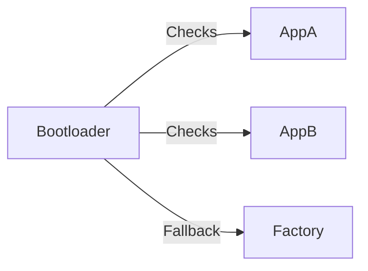

# **Software Requirements Specification (SRS) — Environmental Monitoring & Control System**

## **1. Introduction**

This document defines the software-level requirements for the Environmental Monitoring & Control System. It complements the System Requirements Specification (SyRS) and covers the architecture, communication protocols, memory layout, bootloader logic, and OTA update mechanisms.

## **2. Target Platform**

* **Hardware Type:** ESP32 (abstracted via HAL, can be replaced)  
* **Operating System:** FreeRTOS (abstracted, replaceable)  
* **Architecture Style:** Layered software design (similar to AUTOSAR separation of concerns)

## **3. Software Architecture**

### **3.1 Layered Architecture**

The system employs a strict layered architecture to achieve separation of concerns and reduce interdependencies.

```
+--------------------------------------------------------------+
|                   Application Layer                          |
| +-----------+  +--------------+  +--------+  +-----------+   |
| |  SYS_MGR  |  |  SYS_STARTUP |  | Heater |  | Humadity  |   |
+--------------------------------------------------------------|
| +---------+  +------------+  +-----------+  +--------------+ |
| | FAN_CTL |  | Diagnostic |  | Light_CTL |  |SystemMonitor | |
+--------------------------------------------------------------|
| +--------+ +---------+ +-----------+ +--------+ +---------+  |
| | common | | Display | | TEMP_SENS | | Logger | | STORAGE |  |
+--------------------------------------------------------------|
| +-------+ +------+ +------------+  +----------+              |
| | power | | pump | | ventilator |  | LightInd |              |
+--------------------------------------------------------------|
+--------------------------------------------------------------+
|                  Runtime Environment (RTE)                   |
+--------------------------------------------------------------+
|                        Service Layer                         |
| +----+ +-----+ +------+ +--------+ +----------+ +---------+  |
| | OS | | OTA | | ComM | | MODBUS | | Security | | Factory |  |
+--------------------------------------------------------------+
|                   Hardware Abstraction Layer (HAL)           |
| +----------+ +---------+ +---------+ +----------+ +---------+|
| | HAL_GPIO | | HAL_PWM | | HAL_ADC | | HAL_UART | | HAL_BLE ||
+--------------------------------------------------------------+
| +-----------+  +------------+  +---------+  +----------+     |
| | HAL_TIMER |  | HAL_Modbus |  | HAL_I2C |  | HAL_WIFI |     |
+--------------------------------------------------------------+
|                       MCAL Hardware                          |
| +------+     +-----+     +-----+      +-----+    +-----+     |
| | GPIO |     | PWM |     | ADC |      | I2C |    | spi |     |
+--------------------------------------------------------------+
| +------+  +-----+  +-----+  +------+  +-------+  +--------+  |
| | UART |  | RTC |  | BLE |  | WIFI |  | FLASH |  | EEPROM |  |
+--------------------------------------------------------------+
```

### **3.1.2. Layer Descriptions**

* **Application Layer:** Implements the core business logic and high-level functionalities of the Environmental Monitoring & Control System.  
* **Service Layer:** Provides high-level communication management (ComM), operating system services (os), Over-the-Air (OTA) updates (ota), and security services (security), abstracting complexities from the application layer.  
* **HAL Layer:** Provides hardware-independent interfaces for peripherals and includes higher-level drivers for communication protocols (Modbus, Bluetooth, Wi-Fi).  
* **MCAL Layer:** Device-specific drivers for GPIO, UART, PWM, ADC, etc.

| Layer                 | Module Name       | Description                                                                                                                                                                                                                                     | Covers Req IDs                                                                 |
|----------------------|-------------------|-------------------------------------------------------------------------------------------------------------------------------------------------------------------------------------------------------------------------------------------------|---------------------------------------------------------------------------------|
| **Application Layer**| **Diagnostic**     | Responsible for fault detection, categorization by domain (HAL, Service, Application), fault storage (active and historical), and providing detailed fault information to other modules. Implements retry mechanisms for transient faults and triggers safe state or reboot on persistent faults. | SRS-04-07-04, SRS-04-07-05, SRS-04-07-06, SRS-04-07-07, SRS-04-07-08            |
|                      | **SystemMonitor**  | Monitors system health, processes alarm statuses, activates LED indicators, and interacts with the Diagnostic module for alarm logic and fault response.                                                                                        | SRS-04-04-07, SRS-04-07-01, SRS-04-07-02, SRS-04-07-03                          |
|                      | **Common**         | Provides shared utilities such as logging APIs, rate-limiting mechanisms for security/authentication attempts, and other cross-cutting concerns. Integrates with Security module in the Service Layer for logging failed attempts and enforcing timeouts. | SRS-06-01-02, SRS-07-01-06                                                      |
| **Service Layer**    | **Security**       | Enforces authentication (e.g., BLE pairing), encryption, communication exclusivity (only one interface active), and cryptographic services for OTA and configuration changes. Manages rate limiting and timeout policies in collaboration with Application’s Common module. | SRS-06-01-01, SRS-06-01-03, SRS-06-01-05, SRS-07-01-06                          |
|                      | **ComM**           | Manages communication interfaces, arbitrates active control over actuators to enforce exclusive control policy (Bluetooth or Modbus only active at once). Routes messages to/from HAL drivers and Application Layer.                           | SRS-05-01-01, SRS-05-01-02, SRS-06-01-03                                        |
|                      | **OS**             | Encapsulates FreeRTOS-dependent logic and provides task management and scheduling services to upper layers.                                                                                                                                    | SRS-07-01-02                                                                    |
| **HAL Layer**        | *--*        | Hardware-independent interfaces remain as before, supporting sensors, actuators, communication buses, etc.                                                                                                                                    | All hardware-related functional requirements                                    |
| **MCAL Layer**       | *--*        | Low-level drivers for hardware peripherals.                                                                                                                                                                                                   | Hardware driver requirements                                                    |

### **3.2. Fault & Diagnostic Flow**

* Diagnostic module detects faults reported from all layers (HAL, Service, Application).
* It categorizes faults by severity and domain, stores records in NVM via Storage module.
* SystemMonitor uses diagnostic info to activate alarms, LEDs, and manage system safe states.
* Retry mechanisms implemented in Diagnostic try automatic recovery before escalating faults.
* Persistent faults cause controlled reboot or transition to safe mode.

### **3.3. Communication Management**

* ComM enforces that only one communication interface (Bluetooth or Modbus) controls actuators at a time.
* Security module collaborates to block conflicting commands and prevent unauthorized access.
* Logging of authentication attempts and rate-limiting enforced jointly by Security and Common modules.
* OTA updates require signed images and session authentication enforced via Security module.

### **3.4. User Interaction & Configuration**

* Application Layer modules (Display, Buttons, SYS_MGR) interact with Storage for persisting configuration settings.
* Pump and fan control logic in Application Layer enforces mandatory pump activation and temperature-dependent fan speed control, as specified in constraints.

## **4. Software Functional Requirements**

### **4.1 Monitoring Software Functional Requirements**

* **SRS-04-04-01:** The Software shall acquire current indoor temperature data from the HAL.  
* **SRS-04-04-02:** The Software shall acquire current indoor humidity data from the HAL if a humidity sensor is connected.  
* **SRS-04-04-03:** The Software shall acquire current fan speed data from the HAL.  
* **SRS-04-04-04:** The Software shall manage the alternating display of temperature and humidity readings.  
* **SRS-04-04-05:** The Software shall display the system's version number upon power-on.  
* **SRS-04-04-06:** The Software shall display the maximum and minimum recorded temperatures upon user request.  
* **SRS-04-04-07:** The Software shall display alarm statuses.

### **4.2 Control Output Software Functional Requirements**

* **SRS-04-05-01:** Manage activation/deactivation of the 4 Fan Relay Outputs based on set points and sensor data.  
* **SRS-04-05-02:** Manage the Cool Relay Output.  
* **SRS-04-05-03:** Manage the Spray (OPT) Relay Output.  
* **SRS-04-05-04:** Manage the Heat Relay Output.  
* **SRS-04-05-05:** Manage the Alarm Relay Output.  
* **SRS-04-05-06:** Generate a 0-10V analog signal via A-OUT for variable speed fan control.  
* **SRS-04-05-07:** Control the humidity pump as a mandatory function (SyRS-05-01-02).  
* **SRS-04-05-08:** Control the internal system fan via PWM based on the onboard temperature sensor (SyRS-05-01-03).

### **4.3 User Interaction and Configuration Requirements**

* **SRS-04-06-01:** Process button presses for cycling through display modes.  
* **SRS-04-06-02:** Implement logic to clear recorded temperature data upon a 5-second button press.  
* **SRS-04-06-03:** Provide functionality to modify set points through user interface interactions.  
* **SRS-04-06-04:** Display set points alternately with function names during configuration.  
* **SRS-04-06-05:** Logic for increasing and decreasing set points via designated buttons.  
* **SRS-04-06-06:** Manage navigation between settings and entering/exiting setting modes via buttons.

### **4.4 Alarm and Error Handling**

* **SRS-04-07-01:** Activate alarms if sensor values exceed thresholds.  
* **SRS-04-07-02:** Disable outputs and activate LED1 on system faults.  
* **SRS-04-07-03:** Specific alarm indications logic (e.g., INL, range violations, etc.).  
* **SRS-04-07-04:** The software shall categorize faults by domain (HAL, Service, Application) and severity.  
* **SRS-04-07-05:** The software shall store active and historical fault records.  
* **SRS-04-07-06:** The software shall provide an interface for Diagnostic to retrieve detailed fault information.  
* **SRS-04-07-07:** The software shall implement retry mechanisms for transient faults.  
* **SRS-04-07-08:** The software shall transition to a safe state or trigger a controlled reboot for persistent or critical faults.

### **4.5 Data Handling**

* **SRS-04-08-01:** Continuous data recording capability.  
* **SRS-04-08-02:** Critical configuration parameters and operational settings shall be stored in non-volatile memory (Flash/EEPROM) and persist across power cycles.

### **4.6 Bootloader**

* **SRS-04-01-01:** Secure bootloader stored in dedicated region.  
* **SRS-04-01-02:** Verify application bank integrity using CRC or cryptographic hash.  
* **SRS-04-01-03:** Prioritize most recent valid application bank on startup.  
* **SRS-04-01-04:** Boot into Factory Application if both App A and B fail.  
* **SRS-04-01-05:** Disable JTAG access after final production flag is set.

### **4.7 OTA Update Management**

* **SRS-04-02-01:** Support OTA updates via Bluetooth and Modbus.  
* **SRS-04-02-02:** Write updates to inactive bank (App_A or App_B).  
* **SRS-04-02-03:** Switch to updated bank after restart and integrity check.  
* **SRS-04-02-04:** Secure update process:  
  * Signed image verification  
  * Checksum validation  
  * Session-based authentication  
* **SRS-04-02-05:** The software shall prevent OTA updates from initiating if the system's power supply is deemed insufficient or unstable by the systemMgr (as determined by the power module).

### 4.8 Memory Management




* **SRS-04-03-01:** Flash memory shall be partitioned into:  
  * Bootloader  
  * Factory App (diagnostics & fallback)  
  * Application A (active)  
  * Application B (backup/update target)  
* **SRS-04-03-02:** EEPROM or emulated NVM shall store configuration settings.

### 4.9 System Monitoring

- **SRS-04-09-01:** The software shall provide a fault tracking system with unique fault IDs and active/inactive states.
- **SRS-04-09-02:** The software shall monitor CPU load and trigger a fault if usage exceeds **90%**.
- **SRS-04-09-03:** The software shall monitor total minimum free stack space and trigger a fault if below **2048 bytes**.
- **SRS-04-09-04:** The software shall allow setting and clearing individual faults in a thread-safe manner.
- **SRS-04-09-05:** The software shall allow querying the status of any fault.
- **SRS-04-09-06:** The software shall clear all tracked faults on request.
- **SRS-04-09-07:** The system monitor shall be initialized at startup and run periodically every **1s**.
- **SRS-04-09-08:** Critical faults shall trigger a fail-safe after **5s** if not cleared.
- **SRS-04-09-09:** Health metrics (CPU load, stack usage, task count, uptime) shall be logged every **10s**.


## **5. Communication Management**

### **5.1 ComM (Communication Manager)**

* **SRS-05-01-01:** The ComM module shall act as the central communication stack, managing and orchestrating all external communication protocols (Modbus, Bluetooth, Wi-Fi).  
* **SRS-05-01-02:** The ComM module shall provide a unified interface to the Application and RTE layers for sending/receiving data, handling connection states, and routing messages.  
* **SRS-05-01-03:** The ComM module shall interact with lower-level communication drivers in the HAL layer.

### **5.2 Bluetooth**

* **SRS-05-02-01:** Support BLE 4.0 or higher.  
* **SRS-05-02-02:** GATT-based services for:
  - Configuration update
  - Manual actuator override
  - OTA transfer
### **5.3 Modbus RTU **

* **SRS-05-03-01:** Run over UART (RS485).  
* **SRS-05-03-02:** Support master and slave roles simultaneously.  
* **SRS-05-03-03:** Modbus master retrieve sensor data from external Modbus devices.  
* **SRS-05-03-04:** Support function codes: 0x03, 0x04, 0x06, 0x10.  
* **SRS-05-03-05:** Support OTA firmware update.  
* **SRS-05-03-06:** Support connection to up to 30 nodes.

## **6. Security Requirements**

* **SRS-06-01-01:** BLE pairing shall be required for configuration or OTA.  
* **SRS-06-01-02:** The software shall log and rate-limit authentication attempts.  
* **SRS-06-01-03:** The software shall ensure that only one external communication interface (Bluetooth or Modbus) is actively controlling the system at any given time.  
* **SRS-06-01-04:** The software shall return to safe mode on firmware verification failure.  
* **SRS-06-01-05:** All sensitive communication (e.g., configuration changes, OTA data) shall be encrypted and authenticated using cryptographic services provided by the security module.

## **7. Software Constraints**

* **SRS-07-01-01:** All software modules shall be abstracted to support hardware migration.  
* **SRS-07-01-02:** OS-dependent logic (FreeRTOS) shall be encapsulated in the Service Layer (os module).  
* **SRS-07-01-03:** NVM access shall be managed via a unified API.  
### 7.1 Interface Constraints

- **SRS-07-01-01:** Only one communication interface (BLE or Modbus) active at a time.
- **SRS-07-01-02:** Enforce mandatory pump control.
- **SRS-07-01-03:** Fan control via PWM based on internal temperature sensor.
- **SRS-07-01-04:** Secure Bluetooth firmware updates:
  - Require PIN/pairing
  - Log failed attempts
  - Enforce timeout after 3 minutes
- **SRS-08-04-05:** Store critical settings in NVM.
- **SRS-08-04-06:** Transition system to safe state upon faults.

## **8. Glossary**

* **OTA:** Over-the-Air update  
* **HAL:** Hardware Abstraction Layer (provides higher-level drivers including communication protocols like Modbus, Bluetooth, Wi-Fi)  
* **RTOS:** Real-Time Operating System  
* **BLE:** Bluetooth Low Energy  
* **Modbus RTU:** Industrial protocol for serial communication  
* **CRC:** Cyclic Redundancy Check  
* **JTAG:** Debug hardware interface  
* **NVM:** Non-Volatile Memory (EEPROM/Flash-based)  
* **ComM:** Communication Manager (central communication stack in the Service Layer, orchestrating external protocols)  
* **ON (Power Mode):** ECU is fully powered and operational, all peripherals available.  
* **OFF (Power Mode):** ECU is in its lowest power state, effectively shut down, requiring a power cycle or specific wake-up.  
* **Sleep (Power Mode):** A low-power state where non-essential peripherals are shut down, but basic functionality (e.g., display temp/hum) and wake-up sources remain active.  
* **Automatic (System Mode):** All actuators are controlled automatically by software based on sensor readings and schedules.  
* **Manual (System Mode):** All actuators are directly controlled by user inputs (OnTime/OffTime, On/Off commands).  
* **Hybrid (System Mode):** User defines which actuators are automatic (sensor/schedule-based) and which are manual (user-controlled).