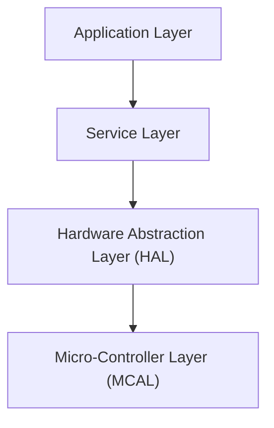
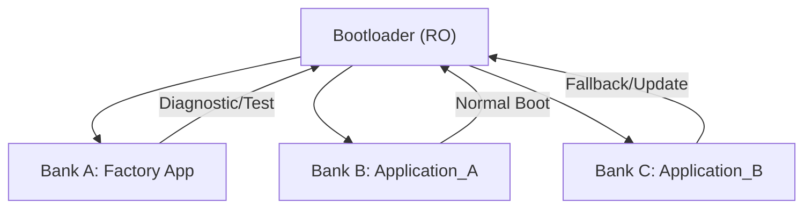

# Software Requirements Specification (SRS) — Environmental Monitoring & Control System

---

## 1. Introduction

This document defines the software-level requirements for the Environmental Monitoring & Control System. It complements the System Requirements Specification (SyRS) and covers the architecture, task design, communication protocols, memory layout, bootloader logic, and OTA update mechanisms.

---

## 2. Target Platform

- **Hardware Type:** ESP32 (abstracted via HAL, can be replaced)
- **Operating System:** FreeRTOS (abstracted, replaceable)
- **Architecture Style:** Layered software design (similar to AUTOSAR separation of concerns)

---

## 3. Software Architecture

### 3.1 Layered Architecture

- **Application Layer**: Implements system logic, control decisions, and user interfaces.
- **Service Layer**: Manages drivers, communication stacks, OTA, and scheduler.
- **HAL Layer**: Provides hardware-independent interface for peripherals.
- **MCAL Layer**: Device-specific drivers for GPIO, UART, PWM, ADC, etc.

---

## 4. Software Functional Requirements

### 4.1 Bootloader

- **SRS-04-01-01:** The system shall include a secure bootloader stored in a dedicated region.
- **SRS-04-01-02:** The bootloader shall verify the integrity of application banks using CRC or cryptographic hash.
- **SRS-04-01-03:** On startup, the bootloader shall prioritize the most recent valid application bank.
- **SRS-04-01-04:** On failure of both App A and B, the bootloader shall boot into Factory Application.
- **SRS-04-01-05:** The bootloader shall disable JTAG access after final production flag is set.

### 4.2 OTA Update Management

- **SRS-04-02-01:** The system shall support OTA firmware updates via Bluetooth and Modbus.
- **SRS-04-02-02:** Updates shall be written to inactive bank (App_A or App_B).
- **SRS-04-02-03:** The bootloader shall switch to updated bank on next restart after integrity check.
- **SRS-04-02-04:** Update process shall be secured with:
  - Signed image verification
  - Checksum validation
  - Session-based authentication

### 4.3 Memory Management

- **SRS-04-03-01:** Flash memory shall be partitioned into:
  - Bootloader
  - Factory App (diagnostics & fallback)
  - Application A (active)
  - Application B (backup/update target)

- **SRS-04-03-02:** EEPROM or emulated NVS shall store configuration settings.

---

## 5. Task Management (RTOS)

- **SRS-05-01-01:** The system shall implement task scheduling using FreeRTOS.
- **SRS-05-01-02:** All I/O and communication tasks shall be non-blocking.
- **SRS-05-01-03:** Each function domain shall run in a separate task:
  - Sensor Acquisition Task
  - Control Logic Task
  - Communication Task
  - UI/LED Task
  - OTA Update Task

---

## 6. Communication Stack

### 6.1 Bluetooth

- **SRS-06-01-01:** BLE 4.0 or higher shall be supported.
- **SRS-06-01-02:** BLE shall provide GATT-based services for:
  - Configuration update
  - Manual actuator override
  - OTA transfer

### 6.2 Modbus RTU

- **SRS-06-02-01:** Modbus RTU protocol shall run over UART (RS485).
- **SRS-06-02-02:** The stack shall support master and slave roles simultaneously.
- **SRS-06-02-03:** Modbus master shall retrieve sensor data from external Modbus devices.

---

## 7. Security Requirements

- **SRS-07-01-01:** BLE pairing shall be required for any configuration or OTA access.
- **SRS-07-01-02:** Authentication attempts shall be logged and rate-limited.
- **SRS-07-01-03:** The system shall reject simultaneous control attempts from BLE and Modbus.
- **SRS-07-01-04:** System shall return to safe mode on firmware verification failure.

---

## 8. Software Constraints

- **SRS-08-01-01:** All software modules shall be abstracted to support hardware migration.
- **SRS-08-01-02:** OS-dependent logic (FreeRTOS) shall be encapsulated in middleware.
- **SRS-08-01-03:** Configuration and NVM access shall be managed via unified API.

---

## 9. Glossary

- **OTA:** Over-the-Air update
- **HAL:** Hardware Abstraction Layer
- **BSP:** Board Support Package
- **RTOS:** Real-Time Operating System
- **BLE:** Bluetooth Low Energy
- **Modbus RTU:** Industrial protocol for serial communication
- **CRC:** Cyclic Redundancy Check
- **JTAG:** Debug hardware interface
- **NVS:** Non-Volatile Storage (EEPROM/Flash-based)
