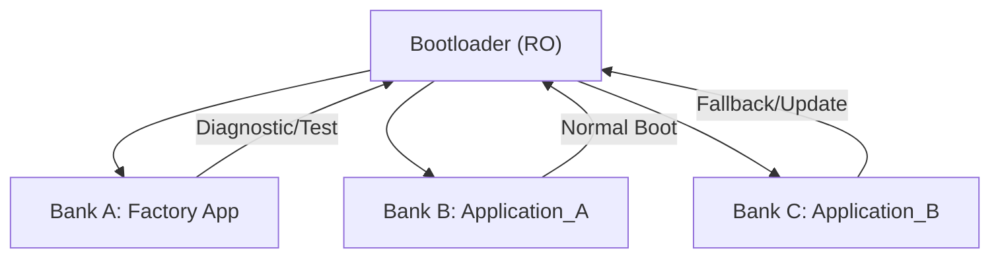

# Software Requirements Specification (SRS) — Environmental Monitoring & Control System

## 1. Introduction
This document defines the software-level requirements for the Environmental Monitoring & Control System. It complements the System Requirements Specification (SyRS) and covers the architecture, communication protocols, memory layout, bootloader logic, and OTA update mechanisms.

## 2. Target Platform
- **Hardware Type**: ESP32 (abstracted via HAL, can be replaced)
- **Operating System**: FreeRTOS (abstracted, replaceable)
- **Architecture Style**: Layered software design (similar to AUTOSAR separation of concerns)

## 3. Software Architecture

### 3.1 Layered Architecture
The system employs a strict layered architecture to achieve separation of concerns and reduce interdependencies.


```
+--------------------------------------------------------------+
|                   Application Layer                          |
| +-----------+  +--------------+  +--------+  +-----------+   |
| |  SYS_MGR  |  |  SYS_STARTUP |  | Heater |  | Humadity  |   |
+--------------------------------------------------------------|
| +---------+  +------------+  +-----------+  +--------------+ |
| | FAN_CTL |  | Diagnostic |  | Light_CTL |  |SystemMonitor | |
+--------------------------------------------------------------|
| +--------+ +---------+ +-----------+ +--------+ +---------+  |
| | common | | Display | | TEMP_SENS | | Logger | | STORAGE |  |
+--------------------------------------------------------------|
| +-------+ +------+ +------------+  +----------+              |
| | power | | pump | | ventilator |  | LightInd |              |
+--------------------------------------------------------------|
+--------------------------------------------------------------+
|                  Runtime Environment (RTE)                   |
+--------------------------------------------------------------+
|                        Service Layer                         |
| +----+ +-----+ +------+ +--------+ +----------+ +---------+  |
| | OS | | OTA | | ComM | | MODBUS | | Security | | Factory |  |
+--------------------------------------------------------------+
|                   Hardware Abstraction Layer (HAL)           |
| +----------+ +---------+ +---------+ +----------+ +---------+|
| | HAL_GPIO | | HAL_PWM | | HAL_ADC | | HAL_UART | | HAL_BLE ||
+--------------------------------------------------------------+
| +-----------+  +------------+  +---------+  +----------+     |
| | HAL_TIMER |  | HAL_Modbus |  | HAL_I2C |  | HAL_WIFI |     |
+--------------------------------------------------------------+
|                       MCAL Hardware                          |
| +------+     +-----+     +-----+      +-----+    +-----+     |
| | GPIO |     | PWM |     | ADC |      | I2C |    | spi |     |
+--------------------------------------------------------------+
| +------+  +-----+  +-----+  +------+  +-------+  +--------+  |
| | UART |  | RTC |  | BLE |  | WIFI |  | FLASH |  | EEPROM |  |
+--------------------------------------------------------------+
```

### 3.1.2 Layer Descriptions
- **Application Layer**: Implements the core business logic and high-level functionalities of the Environmental Monitoring & Control System.
- **Service Layer**: Provides high-level communication management (ComM), operating system services (os), Over-the-Air (OTA) updates (ota), and security services (security), abstracting complexities from the application layer.
- **HAL Layer**: Provides hardware-independent interfaces for peripherals and includes higher-level drivers for communication protocols (Modbus, Bluetooth, Wi-Fi).
- **MCAL Layer**: Device-specific drivers for GPIO, UART, PWM, ADC, etc.

## 4. Software Functional Requirements

### 4.1 Monitoring Software Functional Requirements
- SRS-04-04-01: The Software shall acquire current indoor temperature data from the HAL.
- SRS-04-04-02: The Software shall acquire current indoor humidity data from the HAL if a humidity sensor is connected.
- SRS-04-04-03: The Software shall acquire current fan speed data from the HAL.
- SRS-04-04-04: The Software shall manage the alternating display of temperature and humidity readings.
- SRS-04-04-05: The Software shall display the system's version number upon power-on.
- SRS-04-04-06: The Software shall display the maximum and minimum recorded temperatures upon user request.
- SRS-04-04-07: The Software shall display alarm statuses.

### 4.2 Control Output Software Functional Requirements
- SRS-04-05-01 to SRS-04-05-08: Various fan, pump, relay, and analog signal control functions.

### 4.3 User Interaction and Configuration Requirements
- SRS-04-06-01 to SRS-04-06-06: User interface logic and configuration handling.

### 4.4 Alarm and Error Handling
- SRS-04-07-01 to SRS-04-07-08: Fault management, alarms, diagnostics, safe states.

### 4.5 Data Handling
- SRS-04-08-01: Continuous data recording capability.
- SRS-04-08-02: Non-volatile memory storage for critical parameters.

### 4.6 Bootloader
- SRS-04-01-01 to SRS-04-01-05: Secure bootloader functionality and logic.

### 4.7 OTA Update Management
- SRS-04-02-01 to SRS-04-02-05: OTA update methods, integrity and security.

### 4.8 Memory Management


- SRS-04-03-01: Flash memory shall be partitioned as shown.
- SRS-04-03-02: EEPROM or emulated NVM shall store configuration settings.

## 5. Communication Management

### 5.1 ComM (Communication Manager)
- SRS-05-01-01 to SRS-05-01-03: Centralized communication control.

### 5.2 Bluetooth (HAL Driver)
- SRS-05-02-01 to SRS-05-02-02: BLE requirements.

### 5.3 Modbus RTU (HAL Driver)
- SRS-05-03-01 to SRS-05-03-06: Modbus RTU capabilities.

## 6. Security Requirements
- SRS-06-01-01 to SRS-06-01-05: Authentication, encryption, secure boot and OTA.

## 7. Software Constraints
- SRS-07-01-01 to SRS-07-01-08: Portability, abstraction, mandatory controls, safe fallback.

## 8. Glossary
- **OTA**: Over-the-Air update
- **HAL**: Hardware Abstraction Layer
- **RTOS**: Real-Time Operating System
- **BLE**: Bluetooth Low Energy
- **Modbus RTU**: Industrial protocol for serial communication
- **CRC**: Cyclic Redundancy Check
- **JTAG**: Debug hardware interface
- **NVM**: Non-Volatile Memory
- **ComM**: Communication Manager
- **ON (Power Mode)**: ECU is fully powered
- **OFF (Power Mode)**: ECU is shut down
- **Sleep (Power Mode)**: Low-power state with minimal functionality
- **Automatic (System Mode)**: Sensor/schedule-based control
- **Manual (System Mode)**: Direct user control
- **Hybrid (System Mode)**: Mixed control
