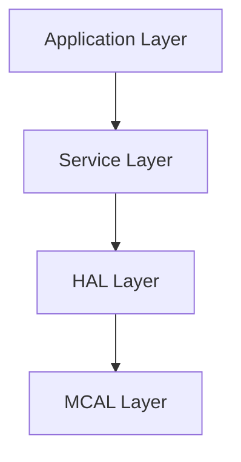
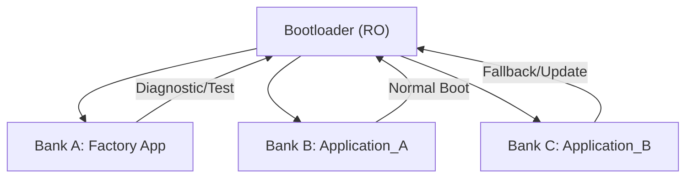

# Software Requirements Specification (SRS) — Environmental Monitoring & Control System

## 1. Introduction
This document defines the software-level requirements for the Environmental Monitoring & Control System. It complements the System Requirements Specification (SyRS) and covers the architecture, communication protocols, memory layout, bootloader logic, and OTA update mechanisms.

## 2. Target Platform
- **Hardware Type:** ESP32 (abstracted via HAL, can be replaced)
- **Operating System:** FreeRTOS (abstracted, replaceable)
- **Architecture Style:** Layered software design (similar to AUTOSAR separation of concerns)

## 3. Software Architecture

### 3.1 Layered Architecture

- **Application Layer:** Implements system logic, control decisions, and user interfaces.
- **Service Layer:** Manages drivers, communication stacks, OTA, and scheduler.
- **HAL Layer:** Provides hardware-independent interface for peripherals.
- **MCAL Layer:** Device-specific drivers for GPIO, UART, PWM, ADC, etc.

## 4. Software Functional Requirements

### 4.1 Monitoring Software Functional Requirements
- **SRS-04-04-01:** The Software shall acquire current indoor temperature data from the HAL.
- **SRS-04-04-02:** The Software shall acquire current indoor humidity data from the HAL if a humidity sensor is connected.
- **SRS-04-04-03:** The Software shall acquire current fan speed data from the HAL.
- **SRS-04-04-04:** The Software shall manage the alternating display of temperature and humidity readings.
- **SRS-04-04-05:** The Software shall display the system's version number upon power-on.
- **SRS-04-04-06:** The Software shall display the maximum and minimum recorded temperatures upon user request.
- **SRS-04-04-07:** The Software shall display alarm statuses.

### 4.2 Control Output Software Functional Requirements
- **SRS-04-05-01:** Manage activation/deactivation of the 4 Fan Relay Outputs based on set points and sensor data.
- **SRS-04-05-02:** Manage the Cool Relay Output.
- **SRS-04-05-03:** Manage the Spray (OPT) Relay Output.
- **SRS-04-05-04:** Manage the Heat Relay Output.
- **SRS-04-05-05:** Manage the Alarm Relay Output.
- **SRS-04-05-06:** Generate a 0-10V analog signal via A-OUT for variable speed fan control.
- **SRS-04-05-07:** Control the humidity pump as a mandatory function (SyRS-05-01-02).
- **SRS-04-05-08:** Control the internal system fan via PWM based on the onboard temperature sensor (SyRS-05-01-03).

### 4.3 User Interaction and Configuration Requirements
- **SRS-04-06-01:** Process button presses for cycling through display modes.
- **SRS-04-06-02:** Implement logic to clear recorded temperature data upon a 5-second button press.
- **SRS-04-06-03:** Provide functionality to modify set points through user interface interactions.
- **SRS-04-06-04:** Display set points alternately with function names during configuration.
- **SRS-04-06-05:** Logic for increasing and decreasing set points via designated buttons.
- **SRS-04-06-06:** Manage navigation between settings and entering/exiting setting modes via buttons.

### 4.4 Alarm and Error Handling
- **SRS-04-07-01:** Activate alarms if sensor values exceed thresholds.
- **SRS-04-07-02:** Disable outputs and activate LED1 on system faults.
- **SRS-04-07-03:** Specific alarm indications logic (e.g., INL, range violations, etc.).

### 4.5 Data Handling
- **SRS-04-08-01:** Continuous data recording capability.

### 4.6 Bootloader
- **SRS-04-01-01:** Secure bootloader stored in dedicated region.
- **SRS-04-01-02:** Verify application bank integrity using CRC or cryptographic hash.
- **SRS-04-01-03:** Prioritize most recent valid application bank on startup.
- **SRS-04-01-04:** Boot into Factory Application if both App A and B fail.
- **SRS-04-01-05:** Disable JTAG access after final production flag is set.

### 4.7 OTA Update Management
- **SRS-04-02-01:** Support OTA updates via Bluetooth and Modbus.
- **SRS-04-02-02:** Write updates to inactive bank (App_A or App_B).
- **SRS-04-02-03:** Switch to updated bank after restart and integrity check.
- **SRS-04-02-04:** Secure update process:
  - Signed image verification
  - Checksum validation
  - Session-based authentication

### 4.8 Memory Management

- **SRS-04-03-01:** Flash memory shall be partitioned into:
  - Bootloader
  - Factory App (diagnostics & fallback)
  - Application A (active)
  - Application B (backup/update target)
- **SRS-04-03-02:** EEPROM or emulated NVM shall store configuration settings.

## 5. Communication Stack

### 5.1 Bluetooth
- **SRS-06-01-01:** Support BLE 4.0 or higher.
- **SRS-06-01-02:** GATT-based services for:
  - Configuration update
  - Manual actuator override
  - OTA transfer

### 5.2 Modbus RTU
- **SRS-06-02-01:** Run over UART (RS485).
- **SRS-06-02-02:** Support master and slave roles simultaneously.
- **SRS-06-02-03:** Modbus master retrieves sensor data from external Modbus devices.
- **SRS-06-02-04:** Support function codes: 0x03, 0x04, 0x06, 0x10.
- **SRS-06-02-05:** Support OTA firmware update.
- **SRS-06-02-06:** Support connection to up to 30 nodes.

## 6. Security Requirements
- **SRS-07-01-01:** BLE pairing required for configuration or OTA.
- **SRS-07-01-02:** Log and rate-limit authentication attempts.
- **SRS-07-01-03:** Reject simultaneous control from BLE and Modbus.
- **SRS-07-01-04:** Return to safe mode on firmware verification failure.

## 7. Software Constraints
- **SRS-08-01-01:** All software modules shall be abstracted to support hardware migration.
- **SRS-08-01-02:** OS-dependent logic (FreeRTOS) shall be encapsulated in middleware.
- **SRS-08-01-03:** NVM access managed via unified API.

### 7.4 Interface Constraints
- **SRS-08-04-01:** Only one communication interface (BLE or Modbus) active at a time.
- **SRS-08-04-02:** Enforce mandatory pump control.
- **SRS-08-04-03:** Fan control via PWM based on internal temperature sensor.
- **SRS-08-04-04:** Secure Bluetooth firmware updates:
  - Require PIN/pairing
  - Log failed attempts
  - Enforce timeout after 3 minutes
- **SRS-08-04-05:** Store critical settings in NVM.
- **SRS-08-04-06:** Transition system to safe state upon faults.

## 8. Glossary
- **OTA:** Over-the-Air update
- **HAL:** Hardware Abstraction Layer
- **BSP:** Board Support Package
- **RTOS:** Real-Time Operating System
- **BLE:** Bluetooth Low Energy
- **Modbus RTU:** Industrial protocol for serial communication
- **CRC:** Cyclic Redundancy Check
- **JTAG:** Debug hardware interface
- **NVM:** Non-Volatile Memory (EEPROM/Flash-based)

